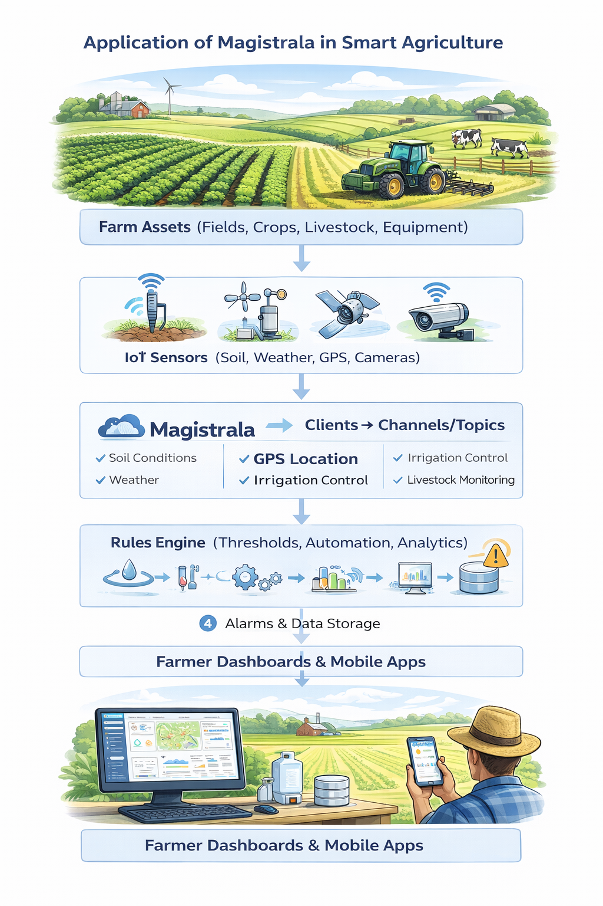

# Smart Agriculture with Magistrala

Modern farming demands precision agriculture and smart farming solutions. Whether managing precision irrigation across vast fields, monitoring soil conditions with IoT sensors, tracking livestock with GPS, or optimizing crop yields through farm automation, farmers need real-time data to make informed decisions and maximize productivity.

Traditional farming approaches—scheduled watering, manual field inspections, reactive problem-solving—waste resources and miss opportunities. Today's agricultural IoT operations require intelligent, connected solutions that provide continuous environmental monitoring, automated responses, and data-driven insights.

Magistrala delivers a comprehensive IoT platform for smart agriculture. With multi-protocol connectivity (including LoRaWAN for remote fields), intelligent automation through the Rules Engine, real-time alarms, and scalable architecture, it transforms how farms monitor conditions, conserve resources, and optimize production.

---

## Table of Contents

- [Solution Structure: Smart Agriculture](#solution-structure-smart-agriculture)
  - [How It Works](#how-it-works)
  - [Key Capabilities](#key-capabilities)
- [Use Cases in Action](#use-cases-in-action)
  - [Precision Irrigation Management](#precision-irrigation-management)
  - [Greenhouse Climate Control](#greenhouse-climate-control)
  - [Livestock Location & Health Monitoring](#livestock-location--health-monitoring)
- [Farming Applications](#farming-applications)
- [Why Magistrala](#why-magistrala)
- [Why Choose Magistrala Over Other Platforms](#why-choose-magistrala-over-other-platforms)
- [Start Farming Smarter Today](#start-farming-smarter-today)

---

## Solution Structure: Smart Agriculture

Building a smart agriculture solution with Magistrala treats all farm assets—fields, crops, livestock, equipment, storage facilities—as monitorable entities with sensor data, location information, and operational status.

### How It Works

1. **Assets equipped with sensors**: Soil moisture sensors, weather stations, livestock trackers, greenhouse monitors, or irrigation controllers
2. **Sensors connect as Clients**: Each device registers in Magistrala with unique credentials
3. **Clients publish to Channels**: Sensors send data to specific **Topics** (soil moisture, temperature, location, tank levels) using MQTT, LoRaWAN, or HTTP
4. **Rules Engine processes data**: Automated logic monitors topics and triggers actions (irrigation control, alerts, analytics)
5. **Users gain insights**: Farmers access dashboards, receive alerts, and make data-driven decisions through mobile apps or web interfaces

### Key Capabilities

**Multi-Protocol Connectivity**: Connect devices via MQTT, HTTP, CoAP, or LoRaWAN. Magistrala handles cellular, Wi-Fi, and long-range LoRa networks—ideal for remote fields without cellular coverage.

**LoRaWAN for Remote Monitoring**: Deploy battery-powered sensors in distant fields that last years on a single battery. LoRa gateways provide kilometers of range with minimal infrastructure.

**Intelligent Rules Engine**: Automate irrigation triggers based on soil moisture thresholds, send alerts when livestock leave designated areas, calculate water usage, and schedule maintenance—no code changes required.

**Real-Time Alarms**: Configure instant alerts for critical conditions—frost warnings, water tank levels dropping below thresholds, livestock wandering outside pastures, equipment malfunctions, or pest detection.

**Enterprise Security**: Mutual TLS authentication, fine-grained access control, and complete audit logs protect farm data and operations.

---

## Use Cases in Action

### Precision Irrigation Management

Agricultural operations managing large acreages across multiple fields need to optimize water usage while maintaining optimal crop conditions. Magistrala with soil moisture sensors and automated irrigation controllers enables:

- **Real-time soil moisture monitoring** across all fields with continuous sensor data
- **Automated irrigation triggers** when moisture falls below optimal thresholds for each crop type
- **Field-specific watering schedules** based on actual soil conditions, weather forecasts, and crop requirements
- **Water usage tracking and analytics** for each irrigation zone with historical comparisons
- **Frost protection automation** triggering protective measures when temperatures approach freezing
- **Integration with weather data** to adjust irrigation based on predicted rainfall

### Greenhouse Climate Control

Greenhouse operations require precise environmental control to maximize crop yields and quality while minimizing energy costs. Magistrala with environmental sensors and climate control systems enables:

- **Real-time monitoring** of temperature, humidity, CO2 levels, and light intensity throughout the greenhouse
- **Automated climate control** adjusting heating, cooling, ventilation, and shading based on optimal growing conditions
- **Zone-based management** controlling different greenhouse sections independently for varied crop requirements
- **Energy optimization** reducing heating and cooling costs through intelligent scheduling and predictive control
- **Supplemental lighting control** activating grow lights when natural light falls below optimal levels
- **CO2 enrichment automation** maintaining optimal CO2 concentrations during photosynthesis periods
- **Humidity management** preventing fungal diseases and optimizing transpiration rates
- **Early warning alerts** for equipment malfunctions, temperature extremes, or ventilation failures

### Livestock Location & Health Monitoring

Livestock operations across vast grazing areas need to monitor animal locations, health indicators, and behavior patterns. Magistrala with GPS/LoRa trackers enables:

- **Real-time location tracking** of livestock across large pastures using long-range LoRaWAN connectivity
- **Geofence alerts** when animals leave designated grazing areas, approach hazards, or enter restricted zones
- **Activity monitoring** detecting unusual behavior patterns that may indicate illness, injury, or distress
- **Herd movement analytics** optimizing pasture rotation and grazing management strategies
- **Calving detection** alerting ranchers to birthing activity requiring intervention or monitoring
- **Water source monitoring** ensuring livestock have access to adequate water supplies
- **Temperature monitoring** for early detection of fever or heat stress in animals

---

## Farming Applications

**Crop Farming**: Monitor soil moisture, temperature, humidity, and nutrient levels across fields with distributed sensor networks. Automate irrigation systems based on real-time soil conditions and weather forecasts. Track water usage by zone to optimize resource allocation and reduce waste. Apply fertilizer precisely where needed based on soil analysis data. Detect frost conditions early and trigger protective irrigation or heating systems to prevent crop damage.

**Livestock Management**: Track animal locations across vast pastures using GPS and LoRaWAN technology. Monitor health indicators including temperature, activity levels, and feeding patterns to detect illness early. Automate feeding schedules based on herd size and nutritional requirements. Detect unusual behavior that may indicate distress, injury, or disease. Manage pasture rotation efficiently by understanding grazing patterns and grass regeneration cycles. Optimize breeding programs with detailed health and activity records.

**Greenhouse Operations**: Monitor temperature, humidity, CO2 levels, and light intensity throughout greenhouse zones. Automate climate control systems including heating, cooling, ventilation, and shading to maintain optimal growing conditions. Control supplemental lighting to extend growing seasons and improve crop quality. Adjust conditions dynamically based on plant growth stages and external weather. Track energy consumption to optimize operational costs while maintaining ideal environments.

**Viticulture & Orchards**: Monitor microclimates across vineyard sections to understand variations in sun exposure, wind, and temperature. Track soil moisture at root depth for precise irrigation that enhances grape quality. Monitor pest activity with sensor networks and deploy targeted treatments. Optimize irrigation schedules to stress vines at the right times for premium wine production. Predict optimal harvest timing based on accumulated heat units and sugar content. Deploy frost protection systems that activate automatically when temperatures drop.

**Aquaculture & Fish Farming**: Monitor water quality parameters including pH, dissolved oxygen, temperature, salinity, and ammonia levels continuously. Automate feeding systems based on fish size, water temperature, and dissolved oxygen levels. Control aeration and water circulation to maintain optimal conditions. Detect early signs of disease through behavior analysis and water quality changes. Prevent catastrophic losses by alerting operators to equipment failures or environmental anomalies before fish are affected.

**Poultry Operations**: Monitor barn temperature, humidity, and ammonia levels to ensure bird health and productivity. Automate ventilation systems to maintain air quality while minimizing heating and cooling costs. Control heating and cooling based on bird age and density. Track feed consumption patterns to detect potential health issues early. Monitor water usage to identify leaks or consumption anomalies. Optimize lighting schedules to improve egg production or growth rates.

**Equipment Management**: Track tractors, harvesters, sprayers, and implements across farm operations with GPS. Monitor fuel levels and consumption rates to plan refueling and identify inefficient operation. Track engine hours and operational data for condition-based maintenance scheduling. Monitor implement usage to allocate costs accurately across different crops or fields. Optimize equipment utilization by identifying idle assets that could be redeployed or rented out.

**Grain Storage**: Monitor temperature and moisture levels in silos and storage facilities to detect hotspots that indicate spoilage. Prevent grain degradation by automating ventilation fans based on internal conditions. Ensure quality preservation throughout storage periods with continuous monitoring. Track inventory levels and automate alerts when stocks fall below thresholds. Maintain compliance with food safety regulations through complete environmental records.

**Smart Beehives**: Monitor hive temperature and humidity to assess colony health and activity. Track hive weight to measure nectar flow and predict honey production. Detect swarming behavior through temperature and weight patterns, allowing intervention before colony loss. Alert to theft or unauthorized hive access with movement sensors. Monitor multiple apiaries across different locations for pollination services or honey production optimization.

**Weather Monitoring**: Deploy weather stations across farm operations providing hyperlocal forecasts more accurate than regional data. Track rainfall, wind speed, temperature, humidity, and barometric pressure. Integrate weather data into irrigation decisions to avoid watering before rain. Use temperature forecasts to plan frost protection, planting schedules, and harvest timing. Accumulate growing degree days for crop development predictions and pest emergence modeling.

---

## Why Magistrala

**LoRaWAN Support**: Deploy long-range, low-power sensors in remote fields without cellular coverage. Battery life measured in years, not months.

**Open Source Freedom**: Apache 2.0 license with no vendor lock-in. Extensible architecture for custom agricultural applications.

**Enterprise-Grade Security**: Mutual TLS authentication, fine-grained access control, complete audit logs for farm operations.

**Scalable Architecture**: Handle thousands of sensors across multiple farms. Deploy on cloud or edge infrastructure.

**Multi-Tenancy**: Single instance serves cooperatives, farm management companies, or agricultural service providers with isolated tenant data.

**Data Persistence**: Store telemetry in Timescale or PostgreSQL for historical analysis, yield predictions, and compliance reporting.

---

## Why Choose Magistrala Over Other Platforms

**True Open Source, No Vendor Lock-In**: Unlike proprietary IoT platforms, Magistrala uses the Apache 2.0 license. You own your deployment, control your data, and can modify the platform to fit your exact needs. No licensing fees as you scale.

**Cloud-Native & Self-Hostable**: Run on Magistrala Cloud for zero infrastructure management, or self-host on your own servers for complete control. Switch between deployment models without rewriting your solution.

**Built for Developers**: Clean REST APIs, comprehensive documentation, and standard protocols (MQTT, HTTP, CoAP, LoRaWAN) mean faster integration. No proprietary SDKs or vendor-specific tooling required.

**Production-Ready Out of the Box**: Enterprise authentication (mutual TLS), fine-grained access control, audit logs, and multi-tenancy are included—not expensive add-ons. Battle-tested architecture handles millions of messages.

**Active Community & Professional Support**: Open development on GitHub means transparency and community contributions. Need help? Direct access to the engineering team at [info@absmach.eu](mailto:info@absmach.eu).

---

## Start Farming Smarter Today

Join innovative agricultural operations using Magistrala to optimize resources, improve yields, and make data-driven farming decisions.

**Play around for free and start building your solution:**

> **Note:** No credit card required for a free trial.

[**Create Your Free Account →**](https://cloud.magistrala.absmach.eu/en/login)

**Need help?** Check out our [documentation](https://docs.magistrala.absmach.eu/) or contact our engineers at [info@absmach.eu](mailto:info@absmach.eu)

---

**Questions?** Join our [community on Matrix](https://matrix.to/#/#magistrala:matrix.org) or contribute on [GitHub](https://github.com/absmach/magistrala)!
