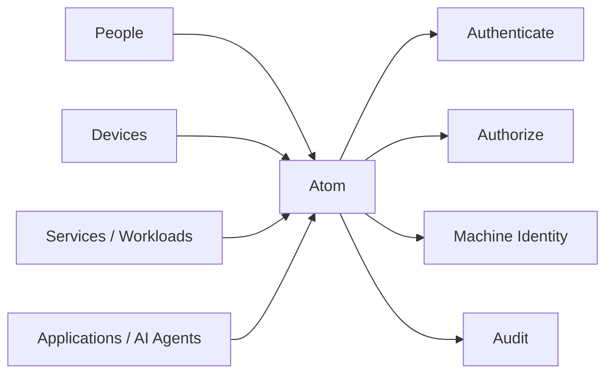

## Atom v1.0.0 LTS Is Here

Today we're releasing **Atom v1.0.0 LTS** — the first stable release of our open-source security control plane for connected software.

Atom started from a problem we kept running into while building [Magistrala](https://www.absmach.eu/products/magistrala): as platforms grow, security logic tends to spread everywhere. Users live in one service, devices in another, roles somewhere else, certificates in separate infrastructure, and authorization state gets synchronized between them through APIs and events.

Eventually, answering a simple question like _"Can this device publish here right now?"_ becomes a distributed-systems problem.

We wanted a simpler foundation.

**One place to know who an actor is, how it authenticated, what it can do right now, and why.**

That became Atom.

And with v1.0.0 LTS, that foundation is now stable enough to build on for the long term.

---

## From Identity Service to Security Control Plane

Modern platforms are no longer just people logging into dashboards.

They have devices, services, workloads, applications, gateways, automation, and AI agents — all acting on resources, often across multiple tenants and environments.

Atom gives those actors one security model.



Humans, devices, services, workloads, and applications are represented through the same entity model. They may prove identity differently — passwords, access tokens, shared keys, OIDC, or certificates — but they are governed by the same live authorization system.

That means security does not have to be rebuilt every time a new kind of actor appears in the platform.

---

## What Makes Atom v1 Different

### One identity model for people and machines

Atom does not split human IAM and machine identity into separate worlds.

A user, device, service, workload, or application can be represented as an entity, given credentials, placed inside the right tenant boundary, assigned access, revoked, and audited through one consistent model.

For connected systems, that matters. The same platform that authenticates an operator also needs to authenticate a gateway, an MQTT client, an internal service, or an autonomous agent.

### Authorization that changes when your system changes

Atom's tokens prove identity; they do not carry a frozen copy of permissions.

Authorization is evaluated against current state using RBAC, ABAC conditions, groups, scoped permissions, direct policies, and explicit deny rules. If a role is removed, a tenant is frozen, a credential is revoked, or a group membership changes, the next authorization decision sees it.

No waiting for a token to expire. No reissuing every credential just because policy changed.

For us, that is one of Atom's defining ideas: **authorization should describe the system as it exists now.**

### Machine identity is part of the same system

Atom v1 also brings managed PKI into the same security model.

Certificates can identify Atom entities just like other credentials. Atom supports managed issuers, certificate enrollment, renewal and revocation, CRL and OCSP publication, EST enrollment, and runtime certificate identity resolution, with optional PKCS#11-backed CA keys.

The result is a much cleaner machine-identity story: a certificate does not merely establish TLS. It represents an entity whose tenant, lifecycle, access, and audit history are already known.

### Small enough to understand and operate

Atom remains deliberately compact:

**one Rust service + PostgreSQL.**

The management surface is GraphQL, runtime integrations use gRPC where appropriate, and the administration UI is optional. Redis can be added for acceleration, and HSM integration can be added for managed CA keys, but neither is required for the core deployment.

We would rather keep the security architecture understandable than turn Atom into another platform made of a dozen mandatory services.

For the full feature and capability inventory, see the [Atom v1 capabilities documentation](https://www.absmach.eu/docs/atom/capabilities/).

---

## What v1.0.0 LTS Means

The most important part of this release is not a particular feature. It is the **compatibility promise**.

Atom's public GraphQL, OpenAPI, and gRPC contracts now form a v1 baseline. Breaking changes belong in a future major version rather than appearing quietly in a minor release.

The database launch schema is also established as a baseline for forward migrations.

The LTS designation adds a second commitment: v1.0 is intended to be a dependable release line for systems where identity and authorization infrastructure cannot be changed casually.

Security infrastructure sits underneath everything else. Stability here matters differently.

---

## Built for Magistrala, Useful Beyond IoT

Atom was built because Magistrala needed a better identity and authorization foundation.

That relationship remains important: Magistrala uses Atom for identities, tenants, roles, resources, credentials, and runtime access decisions, while messaging infrastructure such as FluxMQ can delegate authentication and authorization into the same model.

But Atom itself is product-neutral.

The same architecture fits SaaS platforms, industrial systems, edge deployments, internal developer platforms, service-to-service authorization, connected devices, and AI systems where agents need explicit, revocable, auditable permissions.

The question Atom answers is broader than IoT:

> **Who is acting, and what are they allowed to do right now?**

---

## A Stable Foundation, Not a Finish Line

Reaching v1.0 does not mean Atom is finished.

It means the foundation is defined.

There is plenty ahead: better federation, stronger machine-identity workflows, more integrations, improved policy ergonomics, developer tooling, deployment automation, performance work, and a better operator experience.

The difference is that future work can now build **on top of** the core model instead of continually reshaping it underneath users.

That is what we're celebrating with Atom v1.0.0 LTS.

A security control plane for people and machines, with identity, authentication, live authorization, certificates, and audit brought together in one coherent system — and a stable contract teams can depend on.

---

## Try Atom v1.0.0 LTS

Atom is free and open source under the Apache-2.0 license.

```bash
git clone https://github.com/absmach/atom.git
cd atom
make up
```

- 🌐 Website: https://www.absmach.eu/products/atom
- ⚙️ Release: https://github.com/absmach/atom/releases/tag/v1.0.0
- 📘 Documentation: https://www.absmach.eu/docs/atom
- 🧩 Source: https://github.com/absmach/atom

Thanks to everyone who contributed code, reviews, tests, documentation, architecture discussions, bug reports, and deployment feedback on the road to v1.0.

**Try it, build with it, break it, and tell us what should come next.**
