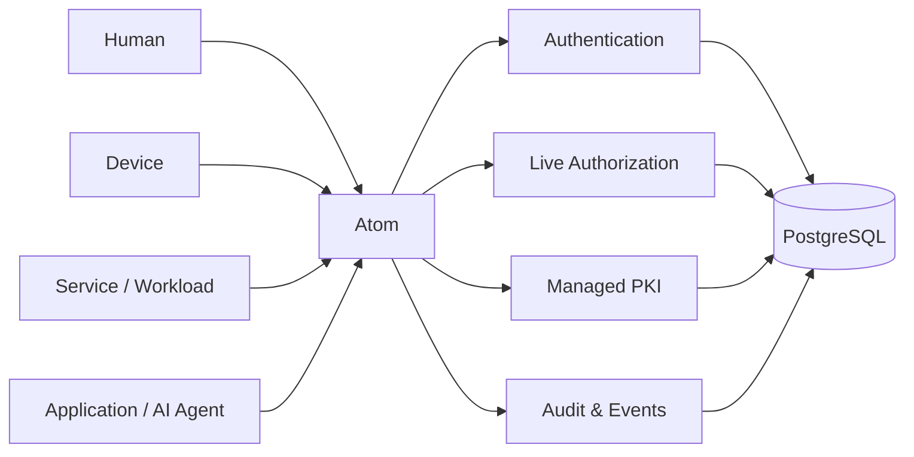

## Atom v1.0.0 LTS

Today we're releasing **Atom v1.0.0 LTS**, the first stable release of our open-source identity and authorization service for IoT, edge, SaaS, AI, and cloud-native systems.

When we [introduced Atom](/blog/atom-announcement/), the goal was deliberately narrow: stop spreading identity state and access policy across multiple services, queues, and databases. Keep the security model in one transactional system, make authorization decisions against current state, and make the result easier to operate and reason about.

v1.0.0 is where that architecture becomes a stable platform contract.

Atom now brings identity, authentication, fine-grained authorization, multi-tenancy, audit, and managed PKI together in **one Rust service backed by PostgreSQL**. It was built for [Magistrala](https://www.absmach.eu/products/magistrala), but the model is product-neutral: people, devices, services, workloads, applications, and AI agents can all use the same identity and access-control foundation.

This release is less about putting a `1.0` label on a project and more about defining the baseline we intend teams to build on for the long term.

---

## What v1.0.0 LTS Means

Before v1.0, Atom's public surface could still move while we refined the model. With v1.0.0, the public API becomes a compatibility boundary.

Atom now treats its **GraphQL schema, OpenAPI surface, and gRPC contracts** as versioned interfaces. Breaking changes belong in a future major release rather than appearing silently inside the v1 line. The launch database schema is also established as a baseline, with subsequent schema evolution expected to happen through forward migrations.

The LTS designation adds an operational commitment on top of that stability. The v1.0 line is intended to be a dependable foundation for systems whose identity and authorization layer cannot change casually every few weeks.

That matters because identity infrastructure sits underneath everything else. A breaking change in a dashboard is inconvenient. A breaking change in authentication, certificate identity, or authorization can stop an entire platform.

---

## One Security Control Plane

Modern systems rarely authenticate only people.

They authenticate users, devices, services, workloads, applications, command-line tools, gateways, and increasingly AI agents. Those actors may use passwords, bearer tokens, shared keys, OIDC, or certificates, but the platform still needs one consistent answer to three questions:

```text
Who is this?
How did it prove its identity?
What is it allowed to do right now?
```

Atom keeps those questions in one model.



Humans, devices, services, workloads, and applications are all first-class **entities**. There is no separate authorization universe for machines and another one for users. A device can authenticate with a certificate, a human can authenticate with a password or OIDC, and a service can use an access token, while all three are evaluated by the same authorization engine.

That symmetry is one of the most important parts of Atom's design.

---

## Authentication Without Splitting the Identity Model

Atom v1.0 supports several authentication paths without creating separate identity types for each credential mechanism:

- password authentication and JWT sessions;
- long-lived access tokens and API-style credentials;
- scoped access tokens with stored permission ceilings;
- shared-key credentials;
- OAuth/OIDC federation;
- certificate-based machine identity.

Credentials belong to entities, and their lifecycle is explicit. Sessions can be revoked, credentials can be rotated or revoked, and changes in entity or tenant state are reflected immediately by the runtime authentication path.

For self-service password changes, Atom requires the current password. Human email identities are canonicalized and unique, and tenant invitations are tied to verified ownership. These details are not headline features, but they are exactly the kind of release hardening that determines whether an identity service is safe to run outside a demo environment.

---

## Authorization Is Live

A core Atom principle is that **tokens prove identity; they do not carry authorization policy**.

When a runtime service needs to know whether an entity can perform an action, it asks Atom. The authorization engine evaluates the caller's current grants, role assignments, group membership, tenant state, conditions, and explicit deny rules at that moment.

That gives Atom an important property: **policy changes take effect without waiting for token expiry or issuing a new token**.

The v1 authorization model includes:

- RBAC through reusable Roles and Permission Blocks;
- ABAC conditions for contextual rules;
- Direct Policies for explicit trusted relationships;
- Principal Groups for grouping subjects;
- Object Groups for grouping protected objects;
- tenant, object-kind, object-type, group, exact-object, and platform scopes;
- assignment guardrails and action applicability;
- deny-overrides-allow semantics;
- authorized-object and access-query APIs for answering operational questions.

The default remains simple: no matching allow means denied, and a matching deny wins.

This is not only about expressing complex policy. It is about making access **explainable**. Operators should be able to answer questions such as:

- What can this entity access?
- Who can access this resource?
- Why was this request denied?
- Which role or direct policy produced this access?
- What changes immediately if this tenant, entity, credential, or group is disabled?

Those are operating questions, not implementation details, so Atom treats them as part of the product surface.

---

## Multi-Tenancy as a First-Class Boundary

Atom models tenants directly instead of treating tenancy as an application-specific convention layered on top of users and roles.

Entities, resources, groups, roles, policies, and credentials can be scoped to tenant boundaries. Human identities can remain global while participating in multiple tenants through memberships and assignments, avoiding duplicated user identities and fragmented audit history.

Tenant lifecycle is part of authorization. If a tenant becomes inactive, frozen, or deleted, Atom can deny access to objects inside that boundary immediately.

For platforms that serve many organizations, sites, factories, projects, or workspaces, this keeps isolation in the security model rather than scattering it through application code.

---

## Atom-Native Multi-Tenant PKI

One of the largest additions on the road to v1.0 is **managed certificate infrastructure built directly into Atom**.

Certificate identity is no longer a separate service beside identity and authorization. Atom can manage certificate authorities, issue certificates, sign CSRs, renew and revoke credentials, publish trust material, and resolve certificate identity at runtime using the same tenant and entity model as every other credential.

The v1 PKI stack includes:

- managed tenant and platform issuers;
- tenant-aware certificate profiles;
- CSR signing and generated-key enrollment;
- certificate renewal and revocation;
- per-issuer CRLs;
- OCSP;
- RFC 7030 EST enrollment;
- certificate lifecycle automation;
- runtime certificate identity resolution;
- optional PKCS#11 HSM-backed CA keys;
- encrypted-database CA key storage when an HSM is not used.

Atom never needs the production root private key. The root stays offline; Atom works with the configured trust chain and managed issuing authorities beneath it.

That gives connected systems a much cleaner machine-identity story: a certificate is not just TLS material. It identifies an Atom entity whose tenant, status, roles, policies, and audit history are already known.

---

## Declarative Bootstrap for Real Deployments

Production platforms need more than an admin account created by hand.

Atom can bootstrap a complete baseline from configuration: entities, credentials, tenants, resources, groups, roles, permission blocks, assignments, direct policies, capabilities, guardrails, and service access tokens.

Config-managed rows are marked as such and protected from normal API mutation. That separation makes infrastructure-defined security state visible to operators without allowing the UI or a routine API call to silently rewrite what deployment configuration owns.

This is especially useful for service identities and platform-level roles. A stack can start with the identities and policy relationships its internal services require instead of relying on a separate provisioning script that races the rest of the deployment.

---

## Performance Without Stale Authorization

Online authorization is attractive because policy changes are immediate, but it puts the authorization service on a hot runtime path.

Atom v1.0 adds **optional Redis acceleration** for authentication and authorization inputs while deliberately avoiding a simple "cache the decision and hope the TTL is short enough" design.

Security-sensitive mutations establish versioned invalidation barriers so revocations, role changes, group changes, tenant state changes, and credential changes cannot quietly leave stale authority active until a cache entry expires. If Redis is not configured, Atom continues to use PostgreSQL directly.

The goal is not caching for its own sake. It is preserving Atom's live-authorization semantics while giving larger deployments room to reduce repeated database work.

---

## APIs for Management and Runtime

Atom separates management workflows from high-frequency runtime decisions while keeping them backed by the same state.

**GraphQL** is the primary management API for identities, tenants, credentials, resources, groups, roles, policies, audit, profiles, and administration workflows.

**gRPC** provides runtime authentication, authorization, and certificate resolution paths for services that need a compact machine-to-machine interface.

Atom also supports broker and external-policy callout integrations, making it possible for messaging infrastructure and other services to delegate authentication or access decisions instead of reproducing security logic locally.

For Magistrala, this is how identity and authorization become a platform foundation rather than a feature hidden inside one application. For other systems, the same contracts can be used independently.

---

## Audit, Events, and Operations

Security infrastructure needs to explain what happened after the request is over.

Atom persists an audit trail and uses a transactional domain-event outbox so state changes and the events describing them do not drift apart. Deployments can also publish events externally, while stdout logs, metrics, health, and readiness endpoints provide the operational signals needed by container and Kubernetes environments.

v1.0 includes the production details expected around those surfaces:

- health and readiness checks;
- Prometheus-style metrics;
- configurable rate limiting;
- trusted-proxy handling;
- graceful shutdown;
- bounded external calls;
- security-sensitive configuration validation at startup;
- optional Redis health behavior;
- PKI provider readiness and lifecycle visibility.

Atom remains intentionally compact: **one Rust binary, one PostgreSQL database**, with Redis, the management UI, and PKCS#11 HSM integration optional depending on deployment needs.

---

## An Optional Management UI

Atom ships with an optional Next.js administration interface for working with the same GraphQL model exposed to automation.

Operators can manage tenants, entities, resources, groups, credentials, actions, roles, permission blocks, policies, profiles, invitations, and audit data without needing to assemble raw API calls for every workflow. Config-managed state is surfaced read-only so the UI reflects deployment-owned security state rather than hiding it.

The UI is optional by design. Atom's API contracts remain the source of truth, so headless deployments and custom control planes do not depend on it.

---

## Quick Start

For local evaluation, Docker Compose starts PostgreSQL, Atom, and the management UI:

```bash
git clone https://github.com/absmach/atom.git
cd atom
make up
```

Then open:

```text
Atom UI:   http://localhost:3005
GraphQL:   http://localhost:8080/graphql
Readiness: http://localhost:8080/health/ready
gRPC:      localhost:8081
```

The repository ships development-only credentials for the local stack. Replace all secrets, signing keys, encryption keys, and deployment defaults before using Atom in a shared or production environment.

For a guided walkthrough of entities, roles, permission blocks, and live authorization checks, see [Getting Started with Atom](/blog/getting-started-with-atom/).

---

## What Comes After v1.0

A stable v1 does not mean Atom is finished. It means new work can build on a defined contract.

There is still room to improve federation, machine identity, deployment automation, developer tooling, policy ergonomics, performance, UI workflows, and integrations. The difference is that those improvements now start from an explicit v1 architecture instead of repeatedly redefining Atom's public foundation.

That is the milestone we're marking with v1.0.0 LTS: **identity, authentication, authorization, certificates, and audit as one coherent security control plane, with a stable interface teams can depend on.**

---

## Get It

Atom v1.0.0 LTS is available now under the Apache-2.0 license.

- 🌐 Website: https://www.absmach.eu/products/atom
- ⚙️ GitHub: https://github.com/absmach/atom/releases/tag/v1.0.0
- 📘 Documentation: https://www.absmach.eu/docs/atom
- 🧩 Source: https://github.com/absmach/atom

Thanks to everyone who contributed code, reviews, tests, documentation, architecture discussions, bug reports, and real deployment feedback on the path to v1.0.0.

Issues, feedback, and contributions are welcome.
