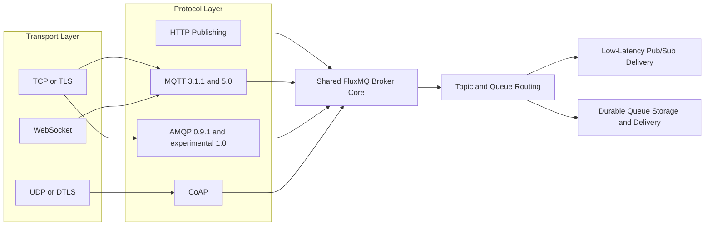
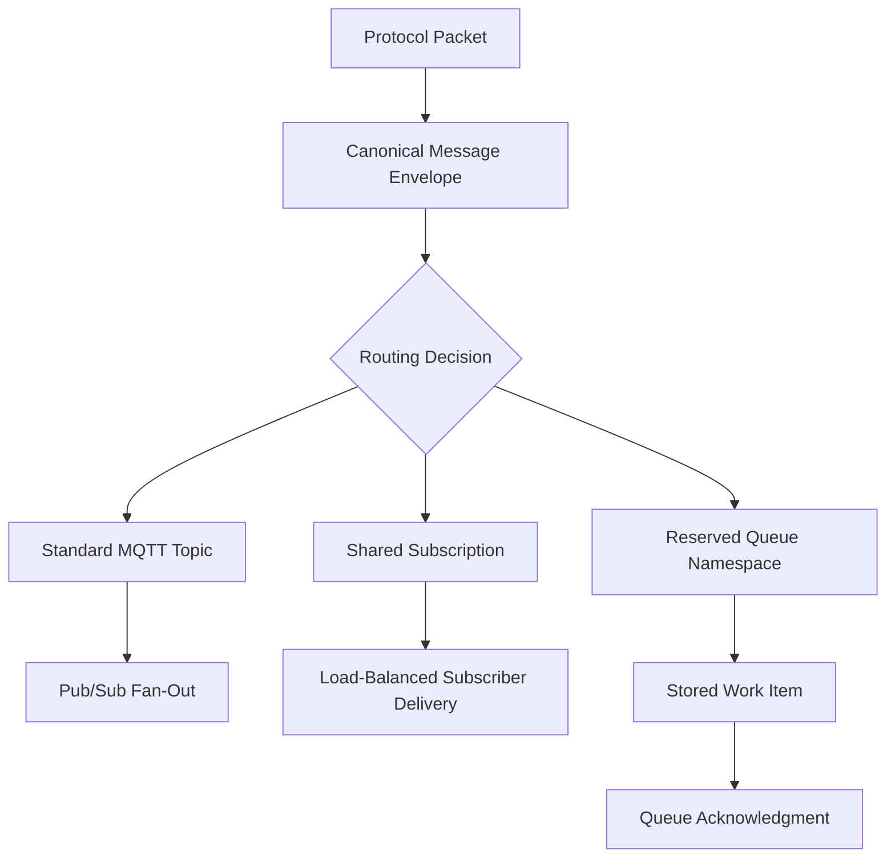

# FluxMQ v1.0.0, multi-protocol IoT messaging

## What's new

FluxMQ v1.0.0 is now available as the semver release tag `v1.0.0`. This release is the point where FluxMQ moves from an MQTT broker shaped by Magistrala messaging requirements into a high-performance, multi-protocol messaging platform for IoT, edge computing, real-time applications, and event-driven systems.

The main change in v1.0.0 is stability. The release defines public APIs and contracts, configuration behavior, error handling, durability semantics, and a canonical message envelope used inside the broker. FluxMQ remains open-source, written in Go, and built for cloud-native distributed systems that need MQTT, pub/sub, and message streaming in one operational footprint.

## Featured changes

### Stable MQTT support for production IoT workloads

FluxMQ v1.0.0 gives IoT developers a stable MQTT surface for device telemetry, command delivery, and real-time pub/sub traffic. The release covers MQTT 3.1.1 and MQTT 5.0, including QoS 0, QoS 1, QoS 2, retained messages, persistent sessions, shared subscriptions, Last Will messages, and MQTT over WebSocket.

That matters because MQTT is still the primary protocol for constrained devices and edge deployments. FluxMQ treats MQTT as a first-class protocol, not a compatibility layer wrapped around an unrelated messaging model. That's the right call.

```bash
mosquitto_sub -h localhost -p 1883 -t 'devices/+/telemetry' -v

mosquitto_pub -h localhost -p 1883 -t 'devices/device-42/telemetry' -m '{"temp":23.7}'
```

### Multi-protocol ingress on a shared broker core

*Multi-Protocol Broker Pipeline*




Platform engineers can accept traffic from different clients without deploying a separate broker for each protocol. FluxMQ v1.0.0 includes MQTT over TCP, MQTT over WebSocket, AMQP 0.9.1, experimental AMQP 1.0, HTTP publishing, and CoAP.

The release keeps protocol boundaries explicit. Transport handling, protocol parsing, broker behavior, routing, and queue delivery each have a defined responsibility. That makes the system easier to reason about under load and during failure analysis.

```text
Transport -> Protocol -> Broker -> Routing -> Queue

TCP/TLS, UDP/DTLS, WebSocket
        -> MQTT, AMQP, HTTP, CoAP
        -> session and protocol behavior
        -> topic and queue routing
        -> pub/sub delivery or durable queue storage
```

### Durable queues alongside pub/sub routing

FluxMQ v1.0.0 supports both low-latency pub/sub and durable queues, so architects can separate transient fan-out from work that must survive consumer downtime. Queue traffic is documented through reserved topic namespaces, while standard MQTT topics continue to use normal pub/sub routing.

Durable queues are important for command processing, asynchronous workflows, and message streaming pipelines where a subscriber may disconnect or scale horizontally. Shared subscriptions remain available for MQTT load-balanced pub/sub delivery, while queue semantics cover stored work and consumer-group style processing.

```text
sensors/temperature        # normal pub/sub topic
$share/workers/sensors/#   # MQTT shared subscription
$queue/orders              # durable queue traffic
$queue/orders/$ack         # queue acknowledgment topic
```

### Security transports for cloud and edge deployments

Operators can run FluxMQ across encrypted transport paths for both data-center and constrained-device environments. v1.0.0 includes TLS, mTLS, DTLS, and mDTLS support across the relevant transport families.

That security model fits cloud-native IoT systems where devices, gateways, and services often sit on different networks. FluxMQ doesn't make broad claims here. Certificate policy, identity mapping, multitenancy, and authorization rules should be configured and validated against the deployment documentation for the target environment.

```yaml
transport_security:
  tls: enabled
  mtls: enabled
  dtls: enabled
  mdtls: enabled
```

### Stable contracts and canonical message flow

*Canonical Message Delivery Flow*




Developers building integrations can now target v1.0.0 contracts with less churn. The release formalizes public APIs, protobuf contracts, configuration behavior, error handling expectations, session ownership rules, and durability semantics.

FluxMQ also standardizes broker-internal message handling around a canonical message envelope. The envelope is described at the contract level in v1.0.0, so this announcement avoids publishing example fields that could be mistaken for a guaranteed schema.

```text
Protocol packet -> canonical message envelope -> routing decision -> pub/sub or durable queue delivery
```

## Other improvements and fixes

- FluxMQ continues to ship as a single binary, which reduces the number of moving parts needed for local development and edge operation.
- Clustering support is part of the v1.0.0 architecture, with session ownership and distributed broker behavior documented as release contracts instead of informal implementation details.
- WebSocket support allows browser and dashboard clients to consume MQTT traffic without a custom bridge.
- CoAP support extends FluxMQ to constrained IoT device patterns where UDP and DTLS are common.
- Future work will be documented in public roadmap and release notes, including areas adjacent to secure IoT research such as post-quantum topics and EU research programs when they become concrete release artifacts.

## Getting started

Use the semver release tag `v1.0.0` when testing or upgrading from source. The project repository and product page are available at [github.com/absmach/fluxmq](https://github.com/absmach/fluxmq) and [FluxMQ](https://www.absmach.eu/products/fluxmq).

```bash
git clone https://github.com/absmach/fluxmq.git
cd fluxmq
git checkout v1.0.0
```

For local builds, follow the repository instructions for your environment and configuration profile. Read the full changelog on [GitHub Releases](https://github.com/absmach/fluxmq/releases) before upgrading production clusters.
