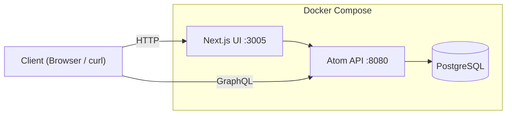
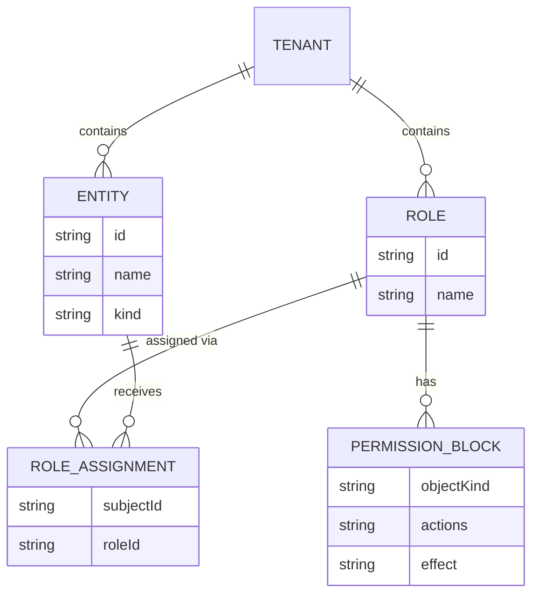

# Getting Started with Atom v0.1.0: Fine-Grained Authorization in Practice

By the end of this guide, you'll have Atom v0.1.0 running locally, a tenant with two entities, a role backed by a permission block, and a verified `authzCheck` returning both allow and deny results. This targets platform engineers evaluating Atom's fine-grained authorization model before committing to an integration. Each step is shown using the management UI; curl equivalents are included for automation or CI use.

You need Docker and Git. No prior Atom experience required.

## Prerequisites

- Docker Engine 24+ and Docker Compose v2
- Git
- `curl` and `jq` (optional, for the API alternatives)

Clone the repository:

```bash
git clone https://github.com/absmach/atom.git
cd atom
```

Copy the example env file and set your admin password:

```bash
cp .env.example .env
# Edit .env and set ADMIN_SECRET to your chosen admin password
```

## Start the Services

_Atom Service Architecture_



Start PostgreSQL first, then bring up the API and management UI:

```bash
docker compose up postgres -d
docker compose --profile atom-ui up -d --build
```

The API listens on port **8080**. The Next.js UI starts on port **3005**. Give both containers about 30 seconds to initialize, then confirm the API is healthy:

```bash
curl -s http://localhost:8080/health | jq .
# {"status":"ok"}
```

## Log In to the Management UI

Open `http://localhost:3005/login` in your browser. Enter your admin credentials and click **Sign in**.


After signing in you land on the dashboard, which shows a summary of tenants, entities, roles, and recent activity across the platform.


<details>
<summary><strong>Using curl instead</strong></summary>

The management UI handles authentication automatically. For direct API access, obtain a Bearer token with:

```bash
QUERY='mutation { login(input: { identifier: "admin", secret: "YOUR_ADMIN_PASSWORD", kind: "password" }) { token } }'
PAYLOAD=$(jq -n --arg q "$QUERY" '{"query":$q}')

TOKEN=$(curl -s -X POST http://localhost:8080/graphql \
  -H "Content-Type: application/json" \
  -d "$PAYLOAD" \
  | jq -r '.data.login.token')

echo "$TOKEN"
```

Pass `-H "Authorization: Bearer $TOKEN"` on every subsequent request.

</details>

## Create a Tenant

_Atom Authorization Data Model_



A tenant is the top-level isolation boundary. All entities, roles, and authorization policies belong to exactly one tenant. Navigate to **Tenants** in the sidebar — it starts empty.


Click **Create**, fill in a name (`acme-corp`) and display name (`Acme Corporation`), then click **Create tenant**.


The new tenant appears in the list.


Click the tenant to inspect it. Copy the **ID** — you'll need it when using the API or Playground later.


**Switch to the tenant context** using the context switcher in the top-left of the sidebar. Select `acme-corp` so that all subsequent operations are scoped to it.

<details>
<summary><strong>Using curl instead</strong></summary>

```bash
QUERY='mutation CreateTenant($input: CreateTenantInput!) { createTenant(input: $input) { id name } }'
PAYLOAD=$(jq -n --arg q "$QUERY" \
  '{"query":$q,"variables":{"input":{"name":"acme-corp","displayName":"Acme Corporation"}}}')

TENANT_ID=$(curl -s -X POST http://localhost:8080/graphql \
  -H "Content-Type: application/json" \
  -H "Authorization: Bearer $TOKEN" \
  -d "$PAYLOAD" \
  | jq -r '.data.createTenant.id')

echo "Tenant: $TENANT_ID"
```

</details>

## Create Entities

Atom models every actor as an entity. The `kind` field classifies it as `human`, `device`, `service`, `workload`, or `application`. Navigate to **Entities** under the acme-corp context.


Click **Create entity**, fill in name `alice` and kind `Human`, then confirm.


Create a second entity: name `billing-service`, kind `Service`. This entity will receive no role assignment, setting up the deny case in the verification step.


Both entities are now listed under acme-corp.


<details>
<summary><strong>Using curl instead</strong></summary>

```bash
QUERY='mutation CreateEntity($input: CreateEntityInput!) { createEntity(input: $input) { id } }'

PAYLOAD=$(jq -n --arg q "$QUERY" --arg tid "$TENANT_ID" \
  '{"query":$q,"variables":{"input":{"tenantId":$tid,"name":"alice","kind":"human"}}}')
ALICE_ID=$(curl -s -X POST http://localhost:8080/graphql \
  -H "Content-Type: application/json" \
  -H "Authorization: Bearer $TOKEN" \
  -d "$PAYLOAD" | jq -r '.data.createEntity.id')

PAYLOAD=$(jq -n --arg q "$QUERY" --arg tid "$TENANT_ID" \
  '{"query":$q,"variables":{"input":{"tenantId":$tid,"name":"billing-service","kind":"service"}}}')
SERVICE_ID=$(curl -s -X POST http://localhost:8080/graphql \
  -H "Content-Type: application/json" \
  -H "Authorization: Bearer $TOKEN" \
  -d "$PAYLOAD" | jq -r '.data.createEntity.id')

echo "Alice: $ALICE_ID  Service: $SERVICE_ID"
```

</details>

## Create a Permission Block

A permission block declares which actions are allowed or denied on a given resource scope. Navigate to **Permission Blocks** and click **Create**.

The wizard has five steps.

**Step 1 — Boundary**: Select `Resource` as the object boundary.


**Step 2 — Scope**: Select **All objects of a kind** and choose `Resource`. This covers every resource in the tenant regardless of its specific type.


**Step 3 — Actions**: Select `read` and `write` as the allowed actions.


**Step 4 — Conditions**: Leave empty for this guide.

**Step 5 — Review**: Confirm and create.


The permission block appears in the list.


<details>
<summary><strong>Using curl instead</strong></summary>

```bash
QUERY='mutation CreatePermissionBlock($input: CreatePermissionBlockInput!) { createPermissionBlock(input: $input) { id } }'
PAYLOAD=$(jq -n --arg q "$QUERY" --arg rid "$ROLE_ID" \
  '{"query":$q,"variables":{"input":{"roleId":$rid,"objectKind":"resource","actions":["read","write"],"effect":"allow"}}}')

curl -s -X POST http://localhost:8080/graphql \
  -H "Content-Type: application/json" \
  -H "Authorization: Bearer $TOKEN" \
  -d "$PAYLOAD" | jq .
```

</details>

## Create a Role and Attach the Permission Block

Navigate to **Roles** and click **Create**. The role wizard has three steps.

**Step 1 — Basics**: Name it `invoices-reader` and add a description.


**Step 2 — Permission Blocks**: Attach the permission block you just created.


**Step 3 — Review**: Confirm and create.


The `invoices-reader` role appears in the roles list.


<details>
<summary><strong>Using curl instead</strong></summary>

```bash
QUERY='mutation CreateRole($input: CreateRoleInput!) { createRole(input: $input) { id } }'
PAYLOAD=$(jq -n --arg q "$QUERY" --arg tid "$TENANT_ID" \
  '{"query":$q,"variables":{"input":{"tenantId":$tid,"name":"invoices-reader","description":"Read access to resources"}}}')

ROLE_ID=$(curl -s -X POST http://localhost:8080/graphql \
  -H "Content-Type: application/json" \
  -H "Authorization: Bearer $TOKEN" \
  -d "$PAYLOAD" | jq -r '.data.createRole.id')
```

</details>

## Assign the Role via the GraphQL Playground

Role assignments are managed through the built-in GraphQL Playground at **Developer → Playground** in the sidebar. The Playground runs authenticated requests under your current session.


Click the **Authz Explain** starter to load a template, then replace the query and variables with the `createRoleAssignment` mutation. Paste alice's entity ID and the `invoices-reader` role ID (both visible in the UI detail views you visited earlier):

```graphql
mutation CreateRoleAssignment($input: CreateRoleAssignmentInput!) {
  createRoleAssignment(input: $input) {
    id
  }
}
```

```json
{
  "input": {
    "tenantId": "<your-tenant-id>",
    "subjectId": "<alice-entity-id>",
    "subjectKind": "entity",
    "roleId": "<invoices-reader-role-id>"
  }
}
```

Click **Run**. A successful response returns the new assignment ID.


The `billing-service` entity remains unassigned, which sets up the deny case in the next step.

<details>
<summary><strong>Using curl instead</strong></summary>

```bash
QUERY='mutation CreateRoleAssignment($input: CreateRoleAssignmentInput!) { createRoleAssignment(input: $input) { id } }'
PAYLOAD=$(jq -n --arg q "$QUERY" --arg tid "$TENANT_ID" --arg sid "$ALICE_ID" --arg rid "$ROLE_ID" \
  '{"query":$q,"variables":{"input":{"tenantId":$tid,"subjectId":$sid,"subjectKind":"entity","roleId":$rid}}}')

curl -s -X POST http://localhost:8080/graphql \
  -H "Content-Type: application/json" \
  -H "Authorization: Bearer $TOKEN" \
  -d "$PAYLOAD" | jq .
```

</details>

## Create a Resource

Before running an authorization check you need a concrete resource to check against. Navigate to **Resources** and click **Create**. Set kind to `channel` and name to `invoice-events`.

> **Note on resource kinds:** In Atom v0.1.0, action applicability (which actions are valid for which object types) is seeded for the built-in resource kinds: `channel`, `rule`, `report`, and `alarm`. Custom kinds like `invoice` require an additional `action_applicability` database entry. Using `channel` here gives you a working demo out of the box.


<details>
<summary><strong>Using curl instead</strong></summary>

```bash
QUERY='mutation CreateResource($input: CreateResourceInput!) { createResource(input: $input) { id name kind } }'
PAYLOAD=$(jq -n --arg q "$QUERY" --arg tid "$TENANT_ID" \
  '{"query":$q,"variables":{"input":{"tenantId":$tid,"kind":"channel","name":"invoice-events"}}}')

RESOURCE_ID=$(curl -s -X POST http://localhost:8080/graphql \
  -H "Content-Type: application/json" \
  -H "Authorization: Bearer $TOKEN" \
  -d "$PAYLOAD" | jq -r '.data.createResource.id')

echo "Resource: $RESOURCE_ID"
```

</details>

## Verify with the Authorization Debugger

Navigate to **Authz** in the sidebar. The Authorization Debugger lets you check any subject/action/target combination and see exactly which permission matched or why access was denied.


**Allow case — alice reads invoice-events:**

Set the form fields:

- **Who**: `alice human`
- **Can do**: `read`
- **Target type**: `Resource`
- **Resource**: `invoice-events channel`

The request preview reads: _"alice wants to read on invoice-events."_ Click **Explain decision**.

The debugger returns **Allowed**, showing the matched permission block from the `invoices-reader` role assigned to alice's tenant.


**Deny case — billing-service reads invoice-events:**

Change **Who** to `billing-service service` and click **Explain decision** again.

The debugger returns **Denied — no matching allow policy**. No permissions are returned because `billing-service` has no role assignment.


<details>
<summary><strong>Using curl instead</strong></summary>

The `authzCheck` mutation takes the entity ID, action name, object kind, and object ID directly:

```bash
QUERY='mutation AuthzCheck($input: AuthzCheckInput!) { authzCheck(input: $input) { allowed reason } }'

# Allow case — alice
PAYLOAD=$(jq -n --arg q "$QUERY" --arg sid "$ALICE_ID" --arg rid "$RESOURCE_ID" \
  '{"query":$q,"variables":{"input":{"subjectId":$sid,"action":"read","objectKind":"resource","objectId":$rid}}}')

curl -s -X POST http://localhost:8080/graphql \
  -H "Content-Type: application/json" \
  -H "Authorization: Bearer $TOKEN" \
  -d "$PAYLOAD" | jq .
```

Expected response:

```json
{
  "data": {
    "authzCheck": {
      "allowed": true,
      "reason": "allowed"
    }
  }
}
```

```bash
# Deny case — billing-service
PAYLOAD=$(jq -n --arg q "$QUERY" --arg sid "$SERVICE_ID" --arg rid "$RESOURCE_ID" \
  '{"query":$q,"variables":{"input":{"subjectId":$sid,"action":"read","objectKind":"resource","objectId":$rid}}}')

curl -s -X POST http://localhost:8080/graphql \
  -H "Content-Type: application/json" \
  -H "Authorization: Bearer $TOKEN" \
  -d "$PAYLOAD" | jq .
```

Expected response:

```json
{
  "data": {
    "authzCheck": {
      "allowed": false,
      "reason": "no matching allow policy"
    }
  }
}
```

The `reason` field isn't decorative. In a distributed system where multiple services perform authorization checks, that detail is what makes a deny decision debuggable without reaching for logs.

</details>

## Troubleshooting

**Login fails with "Sign in failed."** Verify `ADMIN_SECRET` in your `.env` matches the password you are entering. Restart the containers after editing `.env`.

**`401 Unauthorized` on API requests.** Your token has expired or was not captured. Re-run the login curl command and reassign `$TOKEN`.

**`null` values after curl mutations.** The mutation returned a GraphQL error that `jq -r` silently converted to `null`. Drop the `| jq -r ...` pipe and inspect the full response for an `errors` array.

**Postgres connection refused on startup.** The database container may not be fully initialized. Wait 15–20 seconds after `docker compose up postgres -d` before starting the `atom-ui` profile.

**Authorization check returns `"unknown action 'read'"`.** In Atom v0.1.0 the `read` action is only registered for built-in resource kinds (`channel`, `rule`, `report`, `alarm`). Use `kind: "channel"` when creating your test resource, or insert the appropriate row into `action_applicability` for a custom resource kind.

## Next Steps

You now have a working Atom deployment with tenant isolation, typed entity modeling, permission blocks, role assignments, and verified allow and deny authorization decisions.

**Groups**: Use `createGroup` and group membership mutations to model teams, device fleets, or service clusters. Group-level role assignments propagate to all member entities, which is essential for IoT deployments managing large device populations.

**Custom HTTP endpoints**: The Endpoints interface in the Atom UI lets you define REST routes backed by GraphQL operations — the integration path for services that can't speak GraphQL natively.

**mTLS and workload identity**: Atom supports certificate-bound tokens for device and workload entities, the right foundation for edge computing scenarios where password-based authentication isn't appropriate.

**Relationship-based access control**: Atom's graph model supports entity relationships that influence authorization decisions. A workload authorized by its parent device group is a policy structure that flat RBAC can't represent cleanly.
