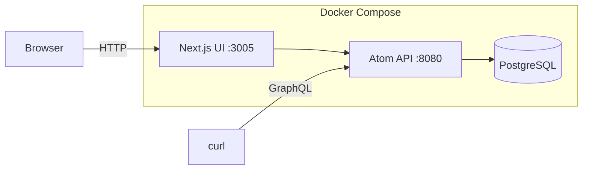

# Getting Started with Atom v0.1.0: Fine-Grained Authorization in Practice

By the end of this guide, you'll have Atom v0.1.0 running locally, a tenant with two entities (Alice and a billing service), two roles backed by permission blocks, and verified authorization checks showing that the billing service can read and write while Alice can only read. Each step is shown using the management UI; curl equivalents are included for automation or CI use.

You need Docker and Git. No prior Atom experience required.

## How Atom is structured

Before diving in, it helps to have a picture of what you're running and what you're building.

**Service architecture**: Atom runs as three containers under Docker Compose. The API exposes a GraphQL endpoint on port 8080 and persists everything to PostgreSQL. The Next.js management UI on port 3005 sits in front of the API and is what you'll use throughout this guide. Your browser talks to the UI; `curl` commands in this guide go directly to the API on port 8080.



## Prerequisites

- Docker Engine 24+ and Docker Compose v2
- Git
- `make`
- `curl` and `jq` (optional, for the API alternatives)

Clone the repository:

```bash
git clone https://github.com/absmach/atom.git
cd atom
```

Copy the example env file:

```bash
cp .env.example .env
```

`.env.example` ships with working local defaults so you can boot the stack without any external service setup. To keep things simple, a few features are disabled out of the box:

- **Email verification** - disabled so you don't need an SMTP provider to create and log in with accounts.
- **Certificate management** - disabled so you don't need to map CA files or bootstrap TLS certificates locally.
- **OAuth** - not configured, so social login buttons won't appear until you add provider credentials.

You can enable any of these by setting the relevant config parameters - see the [Atom configuration docs](https://github.com/absmach/atom#configuration) for details.

## Start the Services

Start the full stack with a single command:

```bash
make up
```

This starts PostgreSQL, the Atom API on **port 8080**, and the Next.js UI on **port 3005**. To follow the logs:

```bash
make logs
```

Once the containers are up, confirm the API is healthy:

```bash
curl -s http://localhost:8080/health | jq .
# {"status":"ok"}
```

## Log In to the Management UI

Open `http://localhost:3005/login` in your browser. Enter your admin credentials and click **Sign in**.


After signing in you land on the dashboard, which shows a summary of tenants, entities, roles, and recent activity across the platform.


<details>
<summary><strong>Using curl instead</strong></summary>

The management UI handles authentication automatically. For direct API access, obtain a Bearer token with:

```bash
TOKEN=$(curl -s -X POST http://localhost:8080/auth/login \
  -H 'Content-Type: application/json' \
  -d '{"identifier": "admin", "secret": "12345678"}' \
  | jq -r '.token')

echo "$TOKEN"
```

Pass `-H "Authorization: Bearer $TOKEN"` on every subsequent request.

</details>

## Create a Tenant

A tenant is the top-level isolation boundary. All entities, resources, roles, and authorization policies belong to exactly one tenant. Navigate to **Tenants** in the sidebar (it starts empty).

Click **Create**, fill in **Name** as `acme-corp` and **Route** as `acme`, then click **Create tenant**.


The new tenant appears in the list.


Click the tenant to inspect it and copy the **ID** if you plan to use the API or Playground later.


**Switch to the tenant context** using the context switcher in the top-left of the sidebar. Select `acme-corp` so that all subsequent operations are scoped to it.


<details>
<summary><strong>Using curl instead</strong></summary>

```bash
QUERY='mutation CreateTenant($input: CreateTenantInput!) { createTenant(input: $input) { id name } }'
PAYLOAD=$(jq -n --arg q "$QUERY" \
  '{"query":$q,"variables":{"input":{"name":"acme-corp","route":"acme"}}}')

TENANT_ID=$(curl -s -X POST http://localhost:8080/graphql \
  -H "Content-Type: application/json" \
  -H "Authorization: Bearer $TOKEN" \
  -d "$PAYLOAD" \
  | jq -r '.data.createTenant.id')

echo "Tenant: $TENANT_ID"
```

</details>

## Create Entities

Atom models every actor as an entity. The `kind` field classifies it as `human`, `device`, `service`, `workload`, or `application`. Navigate to **Entities** under the acme-corp context.

Click **Create entity**, fill in name `Alice` and kind `Human`, then confirm.


Create a second entity: name `billing-service`, kind `Service`.


Both entities are now listed under acme-corp.


<details>
<summary><strong>Using curl instead</strong></summary>

```bash
QUERY='mutation CreateEntity($input: CreateEntityInput!) { createEntity(input: $input) { id } }'

PAYLOAD=$(jq -n --arg q "$QUERY" --arg tid "$TENANT_ID" \
  '{"query":$q,"variables":{"input":{"tenantId":$tid,"name":"Alice","kind":"human","attributes":{}}}}')
ALICE_ID=$(curl -s -X POST http://localhost:8080/graphql \
  -H "Content-Type: application/json" \
  -H "Authorization: Bearer $TOKEN" \
  -d "$PAYLOAD" | jq -r '.data.createEntity.id')

PAYLOAD=$(jq -n --arg q "$QUERY" --arg tid "$TENANT_ID" \
  '{"query":$q,"variables":{"input":{"tenantId":$tid,"name":"billing-service","kind":"service","attributes":{}}}}')
SERVICE_ID=$(curl -s -X POST http://localhost:8080/graphql \
  -H "Content-Type: application/json" \
  -H "Authorization: Bearer $TOKEN" \
  -d "$PAYLOAD" | jq -r '.data.createEntity.id')

echo "Alice: $ALICE_ID  Service: $SERVICE_ID"
```

</details>

## Create a Resource

Before defining access rules, you need a resource to protect. Navigate to **Resources** and click **Create**. Set **Kind** to `channel` and **Name** to `invoice-events`.

> **Note on resource kinds:** In Atom v0.1.0, action applicability (which actions are valid for which object types) is pre-seeded for the built-in resource kinds: `channel`, `rule`, `report`, and `alarm`. Using `channel` here gives you a working demo without any extra setup.


The resource appears in the list.


Click the resource to inspect it and **copy the ID**; you'll need it in the next step when creating permission blocks that target this specific resource.


<details>
<summary><strong>Using curl instead</strong></summary>

```bash
QUERY='mutation CreateResource($input: CreateResourceInput!) { createResource(input: $input) { id name kind } }'
PAYLOAD=$(jq -n --arg q "$QUERY" --arg tid "$TENANT_ID" \
  '{"query":$q,"variables":{"input":{"tenantId":$tid,"kind":"channel","name":"invoice-events"}}}')

RESOURCE_ID=$(curl -s -X POST http://localhost:8080/graphql \
  -H "Content-Type: application/json" \
  -H "Authorization: Bearer $TOKEN" \
  -d "$PAYLOAD" | jq -r '.data.createResource.id')

echo "Resource: $RESOURCE_ID"
```

</details>

## Create Permission Blocks

A permission block is the single source of access logic in Atom. It declares where a rule applies, which actions it covers, and whether those actions are allowed or denied. You'll create two: one that grants `read` and `write`, and one that grants `read` only. Both will target the exact `invoice-events` resource.

Navigate to **Permission Blocks** and click **Create**. The wizard has five steps.

### Read + Write block

**Step 1: Boundary and effect**: Set the **Tenant boundary** to `acme-corp` and set **Effect** to `Allow`.


**Step 2: Scope**: Select **Exact object** as the scope mode, **Resource** as the object kind, **channel** as the object type, and paste the `invoice-events` resource ID you copied in the previous step.


**Step 3: Actions**: Select `read` and `write`.


**Step 4: Conditions**: Leave empty for this guide.

**Step 5: Review**: Confirm and create.


### Read-only block

Click **Create** again and go through the same steps. Steps 1 and 2 are identical. In **Step 3**, select only `read`.


Proceed to review and create.


Both permission blocks are now listed.


<details>
<summary><strong>Using curl instead</strong></summary>

```bash
QUERY='mutation CreatePermissionBlock($input: CreatePermissionBlockInput!) { createPermissionBlock(input: $input) { id } }'

# Read+Write block
PAYLOAD=$(jq -n --arg q "$QUERY" --arg tid "$TENANT_ID" --arg rid "$RESOURCE_ID" \
  '{"query":$q,"variables":{"input":{"tenantId":$tid,"scopeMode":"object","objectKind":"resource","objectType":"resource:channel","objectId":$rid,"effect":"allow","actions":["read","write"]}}}')
RW_BLOCK_ID=$(curl -s -X POST http://localhost:8080/graphql \
  -H "Content-Type: application/json" \
  -H "Authorization: Bearer $TOKEN" \
  -d "$PAYLOAD" | jq -r '.data.createPermissionBlock.id')

# Read-only block
PAYLOAD=$(jq -n --arg q "$QUERY" --arg tid "$TENANT_ID" --arg rid "$RESOURCE_ID" \
  '{"query":$q,"variables":{"input":{"tenantId":$tid,"scopeMode":"object","objectKind":"resource","objectType":"resource:channel","objectId":$rid,"effect":"allow","actions":["read"]}}}')
R_BLOCK_ID=$(curl -s -X POST http://localhost:8080/graphql \
  -H "Content-Type: application/json" \
  -H "Authorization: Bearer $TOKEN" \
  -d "$PAYLOAD" | jq -r '.data.createPermissionBlock.id')

echo "RW block: $RW_BLOCK_ID  Read-only block: $R_BLOCK_ID"
```

</details>

## Create Roles

Roles group one or more permission blocks under a name. You'll create two: `invoices-reader` (backed by the read-only block) and `invoices-reader-writer` (backed by the read+write block).

Navigate to **Roles** and click **Create**. The wizard has three steps.

### invoices-reader role

**Step 1: Basics**: Name it `invoices-reader`.


**Step 2: Permission blocks**: Attach the read-only permission block.


**Step 3: Review**: Confirm and create.


### invoices-reader-writer role

Click **Create** again. Name it `invoices-reader-writer`, attach the read+write permission block, and confirm.


Both roles are now listed.


<details>
<summary><strong>Using curl instead</strong></summary>

```bash
QUERY='mutation CreateRole($input: CreateRoleInput!) { createRole(input: $input) { id } }'

# invoices-reader
PAYLOAD=$(jq -n --arg q "$QUERY" --arg tid "$TENANT_ID" \
  '{"query":$q,"variables":{"input":{"tenantId":$tid,"name":"invoices-reader"}}}')
READER_ROLE_ID=$(curl -s -X POST http://localhost:8080/graphql \
  -H "Content-Type: application/json" \
  -H "Authorization: Bearer $TOKEN" \
  -d "$PAYLOAD" | jq -r '.data.createRole.id')

# Attach read-only block
ATTACH='mutation ReplaceRolePermissionBlocks($roleId: ID!, $permissionBlockIds: [ID!]!) { replaceRolePermissionBlocks(roleId: $roleId, permissionBlockIds: $permissionBlockIds) }'
curl -s -X POST http://localhost:8080/graphql \
  -H "Content-Type: application/json" \
  -H "Authorization: Bearer $TOKEN" \
  -d "$(jq -n --arg q "$ATTACH" --arg rid "$READER_ROLE_ID" --arg bid "$R_BLOCK_ID" \
    '{"query":$q,"variables":{"roleId":$rid,"permissionBlockIds":[$bid]}}')" | jq .

# invoices-reader-writer
PAYLOAD=$(jq -n --arg q "$QUERY" --arg tid "$TENANT_ID" \
  '{"query":$q,"variables":{"input":{"tenantId":$tid,"name":"invoices-reader-writer"}}}')
RW_ROLE_ID=$(curl -s -X POST http://localhost:8080/graphql \
  -H "Content-Type: application/json" \
  -H "Authorization: Bearer $TOKEN" \
  -d "$PAYLOAD" | jq -r '.data.createRole.id')

# Attach read+write block
curl -s -X POST http://localhost:8080/graphql \
  -H "Content-Type: application/json" \
  -H "Authorization: Bearer $TOKEN" \
  -d "$(jq -n --arg q "$ATTACH" --arg rid "$RW_ROLE_ID" --arg bid "$RW_BLOCK_ID" \
    '{"query":$q,"variables":{"roleId":$rid,"permissionBlockIds":[$bid]}}')" | jq .
```

</details>

## Create Direct Policies

A **direct policy** attaches a permission block directly to an entity, bypassing the role assignment step. This is useful for narrow, one-off grants. Here you'll grant Alice read-only access and billing-service read+write access to `invoice-events`.

Navigate to **Policies** in the sidebar and click **Create**. The wizard has four steps.

### Alice: read-only policy

**Step 1: Tenant**: Select `acme-corp`.


**Step 2: Subject**: Select `Alice`.


**Step 3: Permission block**: Select the read-only permission block.


**Step 4: Review**: Confirm and create.


### billing-service: read+write policy

Click **Create** again. Select `acme-corp` as tenant, `billing-service` as subject, and the read+write permission block.


Both policies are now listed.


<details>
<summary><strong>Using curl instead</strong></summary>

```bash
QUERY='mutation CreatePolicy($input: CreatePolicyInput!) { createPolicy(input: $input) { id } }'

# Alice → read-only block
PAYLOAD=$(jq -n --arg q "$QUERY" --arg tid "$TENANT_ID" --arg sid "$ALICE_ID" --arg bid "$R_BLOCK_ID" \
  '{"query":$q,"variables":{"input":{"tenantId":$tid,"subjectId":$sid,"subjectKind":"entity","permissionBlockId":$bid}}}')
curl -s -X POST http://localhost:8080/graphql \
  -H "Content-Type: application/json" \
  -H "Authorization: Bearer $TOKEN" \
  -d "$PAYLOAD" | jq .

# billing-service → read+write block
PAYLOAD=$(jq -n --arg q "$QUERY" --arg tid "$TENANT_ID" --arg sid "$SERVICE_ID" --arg bid "$RW_BLOCK_ID" \
  '{"query":$q,"variables":{"input":{"tenantId":$tid,"subjectId":$sid,"subjectKind":"entity","permissionBlockId":$bid}}}')
curl -s -X POST http://localhost:8080/graphql \
  -H "Content-Type: application/json" \
  -H "Authorization: Bearer $TOKEN" \
  -d "$PAYLOAD" | jq .
```

</details>

## Verify with the Authorization Debugger

Navigate to **Authz** in the sidebar. The Authorization Debugger lets you check any subject/action/resource combination and see exactly which permission matched or why access was denied.


For each check, fill in **Who**, **Can do**, **Target type** (Resource), and **Resource** (invoice-events channel), then click **Explain decision**.

### billing-service can read

- **Who**: `billing-service service`
- **Can do**: `read`

Result: **Allowed.** The read+write permission block granted via direct policy covers `read`.


### billing-service can write

- **Who**: `billing-service service`
- **Can do**: `write`

Result: **Allowed.** The same read+write permission block covers `write`.


### Alice can read

- **Who**: `Alice human`
- **Can do**: `read`

Result: **Allowed.** The read-only permission block granted via direct policy covers `read`.


### Alice cannot write

- **Who**: `Alice human`
- **Can do**: `write`

Result: **Denied.** No matching allow policy. Alice's direct policy only grants `read`; no permission block covering `write` is attached to her.


<details>
<summary><strong>Using curl instead</strong></summary>

```bash
QUERY='mutation AuthzCheck($input: AuthzCheckInput!) { authzCheck(input: $input) { allowed reason } }'

# billing-service - read (expect: allowed)
PAYLOAD=$(jq -n --arg q "$QUERY" --arg sid "$SERVICE_ID" --arg rid "$RESOURCE_ID" \
  '{"query":$q,"variables":{"input":{"subjectId":$sid,"action":"read","objectKind":"resource","objectId":$rid}}}')
curl -s -X POST http://localhost:8080/graphql \
  -H "Content-Type: application/json" \
  -H "Authorization: Bearer $TOKEN" \
  -d "$PAYLOAD" | jq .
# {"data":{"authzCheck":{"allowed":true,"reason":"allowed"}}}

# billing-service - write (expect: allowed)
PAYLOAD=$(jq -n --arg q "$QUERY" --arg sid "$SERVICE_ID" --arg rid "$RESOURCE_ID" \
  '{"query":$q,"variables":{"input":{"subjectId":$sid,"action":"write","objectKind":"resource","objectId":$rid}}}')
curl -s -X POST http://localhost:8080/graphql \
  -H "Content-Type: application/json" \
  -H "Authorization: Bearer $TOKEN" \
  -d "$PAYLOAD" | jq .
# {"data":{"authzCheck":{"allowed":true,"reason":"allowed"}}}

# Alice - read (expect: allowed)
PAYLOAD=$(jq -n --arg q "$QUERY" --arg sid "$ALICE_ID" --arg rid "$RESOURCE_ID" \
  '{"query":$q,"variables":{"input":{"subjectId":$sid,"action":"read","objectKind":"resource","objectId":$rid}}}')
curl -s -X POST http://localhost:8080/graphql \
  -H "Content-Type: application/json" \
  -H "Authorization: Bearer $TOKEN" \
  -d "$PAYLOAD" | jq .
# {"data":{"authzCheck":{"allowed":true,"reason":"allowed"}}}

# Alice - write (expect: denied)
PAYLOAD=$(jq -n --arg q "$QUERY" --arg sid "$ALICE_ID" --arg rid "$RESOURCE_ID" \
  '{"query":$q,"variables":{"input":{"subjectId":$sid,"action":"write","objectKind":"resource","objectId":$rid}}}')
curl -s -X POST http://localhost:8080/graphql \
  -H "Content-Type: application/json" \
  -H "Authorization: Bearer $TOKEN" \
  -d "$PAYLOAD" | jq .
# {"data":{"authzCheck":{"allowed":false,"reason":"no matching allow policy"}}}
```

The `reason` field isn't decorative. In a distributed system where multiple services perform authorization checks, that detail is what makes a deny decision debuggable without reaching for logs.

</details>

## Troubleshooting

Most issues during setup fall into a few predictable categories: authentication, timing, and silent GraphQL errors. Here's how to work through each.

1. **Login fails with "Sign in failed."** The most common cause is a mismatch between `ADMIN_SECRET` in your `.env` and the password you're typing. Edit the file, then restart the containers entirely; changes to `.env` are not picked up by running containers.

2. **`401 Unauthorized` on API requests.** Tokens are short-lived. If you're seeing this mid-session, your token has expired or wasn't captured correctly. Re-run the login curl command, reassign `$TOKEN`, and retry.

3. **`null` values after curl mutations.** This is a silent GraphQL error, not a missing field. The `jq -r` pipe converts error objects to `null` without any warning. Drop the pipe entirely and inspect the raw response; look for an `errors` array in the JSON.

4. **Postgres connection refused on startup.** The database container needs a moment to fully initialize before accepting connections. If you see this, wait 15–20 seconds after starting and then check again.

5. **Authorization check returns `"unknown action 'read'"`.** In Atom v0.1.0, the `read` action is only registered for built-in resource kinds (`channel`, `rule`, `report`, `alarm`). Use `kind: "channel"` for your test resource, or add the appropriate row to `action_applicability` if you're working with a custom kind.

## Next Steps

With a working deployment behind you, you've touched every core layer of Atom: tenant isolation, typed entity modeling, resources, permission blocks, roles, direct policies, and verified allow and deny decisions. What comes next depends on the shape of your use case.

1. **Profiles** let you define custom subtypes for entities. A `Profile` describes an entity subtype, for example `client`, `gateway`, or `water_meter`, so entities can be organized and filtered beyond their base `kind`. Navigate to **Profiles** in the sidebar to explore the built-in profiles or create your own.

2. **Actions and Action Applicability** control which operations are valid for which object types. Atom uses global action names like `read`, `write`, `publish`, and `subscribe`. Action Applicability declares that, for example, `publish` is a valid action for `resource:channel` objects. This is a validity check, not an access grant; a permission block must still cover the action. Navigate to **Actions** to see the registered applicability rules.

3. **The GraphQL Playground** at **Developer → Playground** in the sidebar gives you direct access to the Atom API under your current session. Use it to explore available mutations and queries, inspect responses, and test more advanced operations like role assignments, group membership, or conditional permission blocks.

4. **Groups** let you model teams, device fleets, or service clusters as a unit. Use `createGroup` and the group membership mutations to assign roles at the group level; those assignments propagate automatically to every member entity. For IoT deployments managing large device populations, this is the feature that makes policy administration tractable.

5. **mTLS and workload identity** are the right foundation for edge and device scenarios where password-based authentication isn't appropriate. Atom supports certificate-bound tokens for device and workload entities, giving you strong identity at the hardware level.

6. **Relationship-based access control** is where Atom's graph model separates itself from flat RBAC. Entity relationships can directly influence authorization decisions. A workload that inherits authorization from its parent device group is a policy structure that role tables alone can't represent. If your access model has hierarchy or delegation in it, this is worth exploring early.
