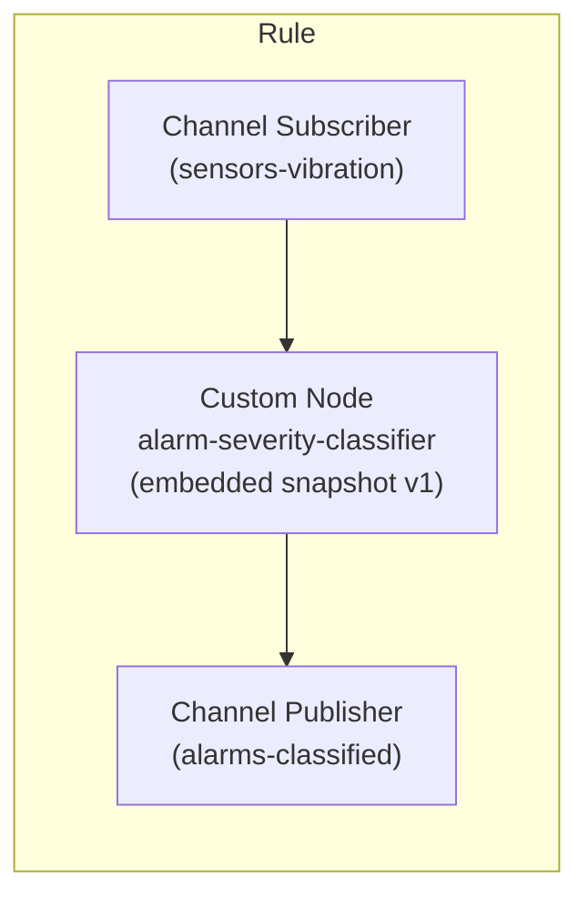
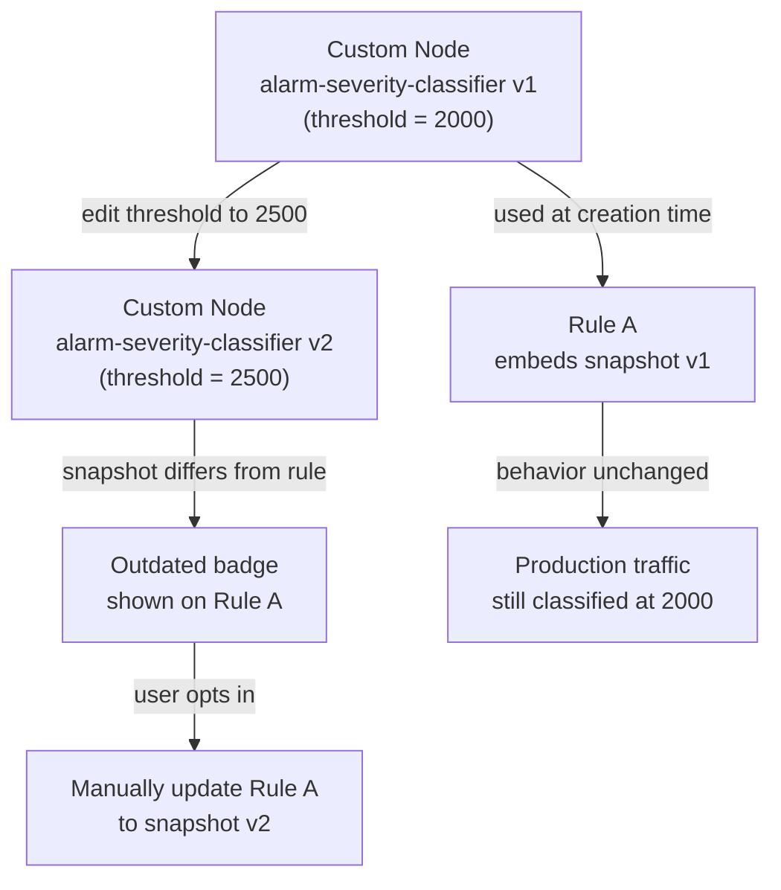

If you run more than a handful of rules in Magistrala's Rules Engine, you've probably copy-pasted the same scoring or threshold script into more than one Code Editor node. It works, until someone needs to change the threshold value. Now you're hunting through every rule that touched that logic, editing each Code Editor block by hand and hoping you didn't miss one.

Custom Nodes fix that. Write a Lua or Go script once in the Custom Nodes section of the Magistrala UI, then drop it into any rule in the same domain as a reusable logic node. This tutorial walks through building a Custom Node that classifies alarm severity from sensor readings, wiring it into a rule, and then editing the shared node later, so you can see how Magistrala keeps existing rules from silently changing behavior in production.

## Prerequisites

- A Magistrala instance (self-hosted or hosted) running a version of the Rules Engine with Custom Nodes support
- Access to a domain where you can create channels, rules, and Custom Nodes
- At least one channel already receiving JSON payloads over MQTT, HTTP, CoAP, or WebSocket
- Basic familiarity with Lua, the default Custom Node language (Go is also supported)
- A way to publish test payloads to your channel, such as `mosquitto_pub` for MQTT
- A user role with permission to create and edit rules and Custom Nodes in the domain

## Create your first Custom Node

Open the Magistrala UI and click **Custom Nodes** in the sidebar. The first time you visit, the list is empty:


Click **+ Create**. The dialog asks for a few fields before you can save:

- **Name**: required, must be unique within the domain, for example `alarm-severity-classifier`
- **Description**: optional, useful once you have more than a few nodes
- **Icon**: required, chosen from a searchable icon picker
- **Tags**: optional, comma-separated; press Enter after each tag to commit it
- **Language**: Lua by default, or Go
- **Code**: required

A Lua Custom Node must define `function logicFunction()` and end the script with `return logicFunction()`. Magistrala calls that function with the incoming message available as `message`, and whatever it returns becomes the node's output.

Paste the following into the Code field. It loops over `message.payload`, compares each value against a threshold of 2000, and buckets the result into severity 3, 4, or 5:

```lua
function logicFunction()
    local threshold = 2000
    local results = {}

    for i, entry in ipairs(message.payload) do
        local value = entry.value
        local severity = 0
        local cause = ""

        if value >= threshold * 2 then
            severity = 5
            cause = "Critical level exceeded"
        elseif value >= threshold * 1.5 then
            severity = 4
            cause = "High level detected"
        elseif value >= threshold then
            severity = 3
            cause = "Threshold reached"
        end

        if severity > 0 then
            table.insert(results, {
                measurement = entry.measurement,
                value = value,
                threshold = threshold,
                cause = cause,
                unit = entry.unit,
                severity = severity
            })
        end
    end

    return results
end

return logicFunction()
```

Set Name to `alarm-severity-classifier`, pick an icon, add tags like `alarms, severity` if you want the node searchable later, and click **Create**. The node appears in the Custom Nodes table at version `v1`.


## Browse and filter the Custom Nodes table

Every node you create shows up in the Custom Nodes table, alongside Icon, Name, Description, Language, Version, Created By/At, and Updated By/At, plus Edit and Delete actions. Once you've got more than a handful of nodes, use the filter toggle next to the search box to switch between filtering by Name and filtering by Tag. You can also sort the table by Name, Created At, or Updated At, in either direction.


Confirm your `alarm-severity-classifier` node shows Language: Lua and Version: v1. That version number matters, since you'll edit this node later in the tutorial.

## Wire the Custom Node into a rule

_Rule pipeline with a Custom Node_



Create a new rule, or open an existing one, and add an input node. Choose **Channel Subscriber** and point it at the channel that receives your sensor payloads, for example `sensors-vibration`.

Click **Add Logic** on the canvas. A **Select a logic type** dialog opens, listing the built-in options (Comparison and Code Editor) side by side with every Custom Node you've created in the domain. Click your `alarm-severity-classifier` node to drop it onto the canvas, then connect it to the Channel Subscriber's output.


Add an output node, choose **Channel Publisher**, point it at a channel for classified alarms, for example `alarms-classified`, and connect the logic node's output to it. Click **Save**.

Success looks like a rule with three connected nodes: Channel Subscriber, alarm-severity-classifier, and Channel Publisher. Behind the scenes, Magistrala embeds a snapshot of the node's current version (v1) into the rule. That's what keeps the rule's behavior independent of anything that happens to the shared Custom Node, until you decide otherwise.

## Edit the shared node and trigger the Outdated badge

_Versioning: shared node edits vs. embedded snapshots_



Suppose your team decides the alarm threshold should move from 2000 to 2500. Open **Custom Nodes**, click **Edit** on `alarm-severity-classifier`, and update the threshold value in the Code field:

```lua
function logicFunction()
    local threshold = 2500
    local results = {}

    for i, entry in ipairs(message.payload) do
        local value = entry.value
        local severity = 0
        local cause = ""

        if value >= threshold * 2 then
            severity = 5
            cause = "Critical level exceeded"
        elseif value >= threshold * 1.5 then
            severity = 4
            cause = "High level detected"
        elseif value >= threshold then
            severity = 3
            cause = "Threshold reached"
        end

        if severity > 0 then
            table.insert(results, {
                measurement = entry.measurement,
                value = value,
                threshold = threshold,
                cause = cause,
                unit = entry.unit,
                severity = severity
            })
        end
    end

    return results
end

return logicFunction()
```

Click **Save**. The table now shows Version: v2 for this node, and the Updated By/At columns reflect the change.

Go back to the rule you built earlier. The `alarm-severity-classifier` node's card now displays an **Outdated** badge, because the rule's saved snapshot is still pinned to v1. Magistrala doesn't rewrite that snapshot automatically. A threshold tweak in one node can't silently change behavior across every rule that uses it, which is the whole point.


## Sync the outdated rule deliberately

When you're ready to adopt the new logic in this rule, click **Sync** on the node's card. The Outdated badge disappears and the card's version number updates to v2, showing that the snapshot now matches the latest shared code. Click **Update Rule** to persist that change. The sync only exists in the open editor until you do.


If you decide this particular rule should keep behaving the way it always has, say because it feeds a dashboard tuned to the old threshold, skip Sync entirely. The rule keeps running against its v1 snapshot indefinitely, and the Outdated badge just sits there as a marker rather than something you have to act on right away. Deleting the Custom Node later wouldn't retroactively break this rule either, since the snapshot already lives inside the rule itself.

## Override node logic for a single rule without touching the shared version

Sometimes you want a one-off tweak that shouldn't affect every rule using the node. Open the logic node's card inside a specific rule and edit its code directly, without going through **Custom Nodes**, then save the rule.

That edit gets stored locally to this rule only. The node's card now shows a **conflict** state instead of Outdated, signaling that this rule's copy has diverged from both the version it was synced to and the current shared definition.


Be careful with Sync once you're in a conflict state. Clicking **Sync** pulls in the latest shared version and overwrites your local edits. There's no merge step. If you want to keep a local override permanently, leave that node unsynced.

## Verification

Publish a test payload to the channel your rule subscribes to:

```bash
mosquitto_pub -h your-magistrala-host -p 8883 \
  --cert client.crt --key client.key --cafile ca.crt \
  -t channels/<channel-id>/messages \
  -m '{"payload": [{"measurement": "vibration", "value": 4200, "unit": "mm/s"}]}'
```

Check the `alarms-classified` channel, or wherever your Channel Publisher output points. You should see a message like:

```json
{
  "measurement": "vibration",
  "value": 4200,
  "threshold": 2500,
  "cause": "High level detected",
  "unit": "mm/s",
  "severity": 4
}
```

A value below the threshold produces no output at all, since the Lua script only appends an entry once `value >= threshold`. See the classified message with the right severity and cause, and you'll know the rule and the Custom Node are wired together correctly, end to end.

## Troubleshooting

- **Rule produces no output at all**: check that the Lua script ends with `return logicFunction()`, not just a function definition. Without that final call, Magistrala has nothing to execute.
- **"Name already exists" error when creating a node**: Custom Node names must be unique per domain. Use the Name filter on the Custom Nodes table to check for near-duplicates before creating a new one.
- **Outdated badge will not clear after clicking Sync**: syncing updates the version shown in the rule editor, but it doesn't persist until you also click **Update Rule**. If you refresh and the badge is back, the sync was never saved.

## Next steps

With one alarm-severity node reused across every rule that needs it, a threshold change becomes a single edit and a deliberate Sync, not a search across your entire rule library. That difference compounds as your rule count grows. Teams running dozens of rules across MQTT, CoAP, HTTP, and WebSocket inputs get consistent scoring logic without maintaining a separate codebase outside the platform.

Custom Nodes are scoped per domain, so plan naming and tagging conventions early, especially in multi-tenant deployments where separate teams manage their own domains independently. If your logic is CPU-intensive, or needs capabilities beyond Lua's sandbox, revisit the same workflow using Go instead. The Custom Node dialog, table, versioning, and sync behavior work identically no matter which language you pick.

From here, read through the Rules Engine reference in the [Magistrala documentation](https://www.absmach.eu/docs/magistrala/) to see the full set of built-in input, logic, and output node types you can combine with your own Custom Nodes.
