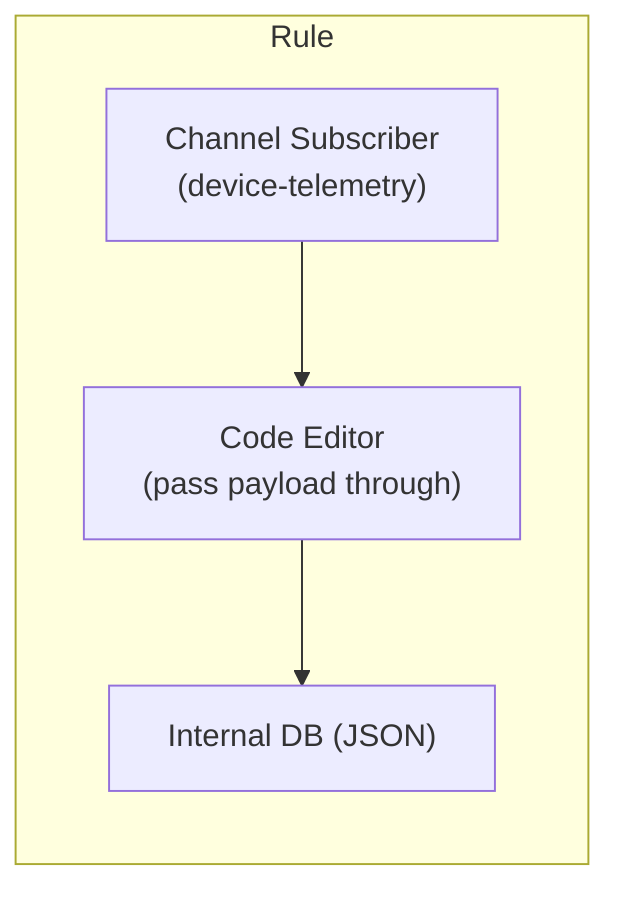

Until now, if you wanted a rule to save its result into Magistrala's internal database, that result had to be a valid SenML message. Anything else meant writing a Lua or Go script to reshape your payload into `n`/`v`/`u` fields first, whether or not SenML actually made sense for what you were storing. A JSON object with a handful of arbitrary keys - a device's full config blob, a structured event log, a payload with nesting that doesn't map cleanly onto a flat SenML record - had nowhere to go except through that conversion step, or not at all.

The Rules Engine now has a second **Internal DB** output alongside the existing one: **Internal DB (JSON)**. It stores whatever your logic script returns, as-is, with no SenML validation. This walks through wiring it into a rule, what has to be deployed for the message to actually persist, and how to check it worked.

## Prerequisites

- A Magistrala instance (self-hosted or hosted) running a version with the Internal DB (JSON) rule output
- Access to a domain where you can create channels and rules
- A JSON-capable message writer deployed - see [Running SenML and JSON Writers Together](https://www.absmach.eu/docs/magistrala/dev-guide/dev-tools/storage#running-senml-and-json-writers-together) if you haven't set one up yet. Without it, the rule runs fine and reports success, but nothing gets persisted.
- A way to publish a test payload to your channel, such as `mosquitto_pub` for MQTT
- A user role with permission to create and edit rules in the domain

## Build a rule that saves raw JSON

_Rule pipeline with the new JSON output_



Create a new rule and add an input node: **Channel Subscriber**, pointed at the channel receiving your JSON payloads, for example `device-telemetry`.

For the simplest case, your logic script can just pass the payload straight through:

```lua
function logicFunction()
  return message.payload
end
return logicFunction()
```

Nothing about that script is SenML-specific - it works whether `message.payload` is a flat object, a nested one, or an array of objects. That's the point: the JSON output doesn't care about shape, only that the result is JSON-marshalable.

Add an output node. Click **Add Output**, and you'll now see two Internal DB cards side by side: **Internal DB**, labeled "Save data in SenML format", and **Internal DB (JSON)**, labeled "Save data in JSON format".


Pick the second one and connect your logic node's output to it. Click **Save**. Your rule canvas should now look like this:


The two are independent outputs - a rule can have both a SenML and a JSON Internal DB node at once if you want the same result saved both ways, capped at one of each.

## What the JSON output actually does differently

The existing SenML output validates the logic's result against the SenML spec before saving it; if it doesn't decode as valid SenML, the rule execution fails. The JSON output skips that check entirely - `json.Marshal`-able is the whole requirement.

It also handles routing differently. Internally, the message writer that eventually persists your data derives its destination table from the last segment of the message's subtopic (this is existing behavior shared with the plain-JSON transformer, not something specific to this new node). The JSON output node sets that automatically so the message lands in a table literally named `json` - the same one a JSON-format [Message View](https://www.absmach.eu/docs/magistrala/user-guide/message-views) queries by default. You don't configure a table name yourself; there's nothing to fill in on this node besides adding it to the rule.

## Verification

Publish a test payload to the channel your rule subscribes to:

```bash
mosquitto_pub -h your-magistrala-host -p 1883 \
  -u <client_id> -P <client_secret> \
  -t m/<domain_id>/c/<channel_id> \
  -m '{"firmware_version": "2.4.1", "battery_pct": 87, "diagnostics": {"last_reboot": "2026-08-01T09:12:00Z", "error_count": 0}}'
```

Open the channel's Messages page in the Magistrala UI, and create (or select) a JSON-format Message View. You should see your message show up, with the built-in **Payload** column exposing a read-only, syntax-highlighted view of the full object:


Click a row's **JSON** button to open the payload:


If nothing shows up, work through the troubleshooting list below before assuming the rule itself is broken - the most common cause by far is the writer deployment step.

## Troubleshooting

- **Rule saves successfully but nothing appears in Message Views**: this is almost always the writer, not the rule. A rule publishing to the JSON output only gets the message onto the bus; a JSON-configured writer has to be deployed and actually subscribed to pick it up and persist it. Confirm you've done the [writer setup](https://www.absmach.eu/docs/magistrala/dev-guide/dev-tools/storage#running-senml-and-json-writers-together) - a plain SenML `timescale-writer` alone won't save these.
- **Rule execution fails outright**: check that your logic script actually returns a non-nil value - same requirement as every other output type. If you're passing `message.payload` straight through, confirm the incoming message really is JSON and not something your input parsing already flattened.
- **Message appears in the wrong table / doesn't show up in the JSON Message View specifically**: this only happens if something upstream of the rule engine is publishing directly with a custom subtopic instead of going through the Internal DB (JSON) node, which sets the routing correctly on its own. If you're publishing test messages directly rather than through a rule, make sure your writer's table-naming convention lines up with what your Message View is querying.

## Next steps

Saving JSON directly closes the gap between what the Rules Engine could store and what [Message Views](https://www.absmach.eu/docs/magistrala/user-guide/message-views) could already display - the JSON viewer and column configurator were live before there was a straightforward way to get JSON-shaped data into the internal database in the first place. Now there is.

Read the [Rules Engine reference](https://www.absmach.eu/docs/magistrala/user-guide/rules-engine) for the full set of output node types, and the [storage guide](https://www.absmach.eu/docs/magistrala/dev-guide/dev-tools/storage) for how writer deployment works if you're planning to run SenML and JSON side by side in production.
