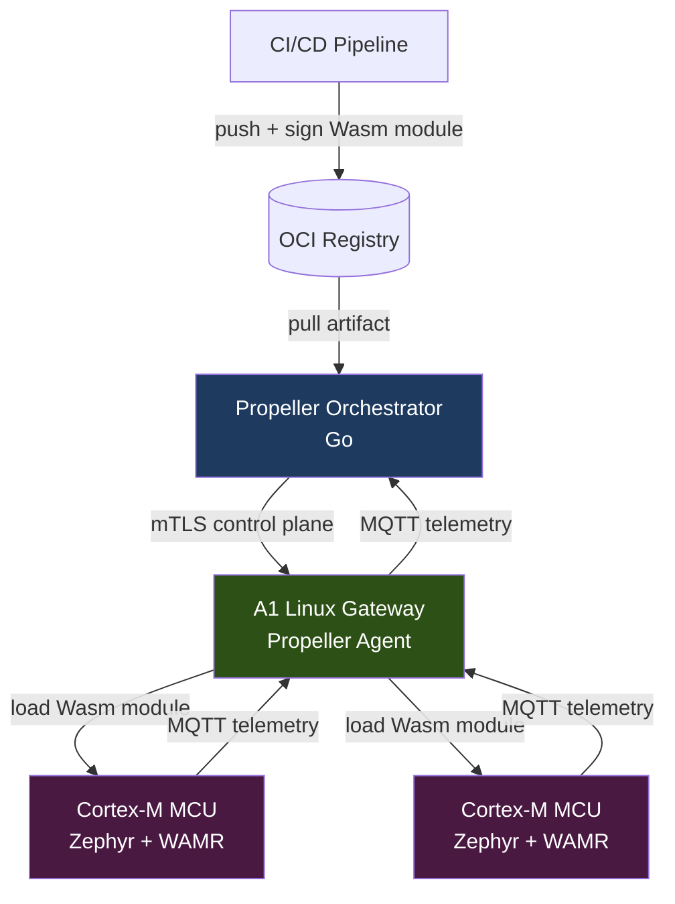
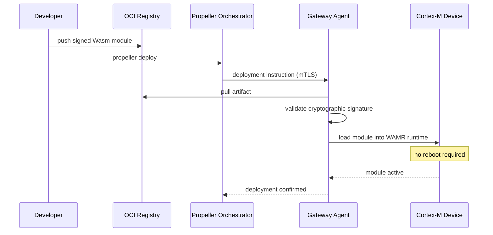

## Introducing Propeller

We've been building edge infrastructure for a while. Not "edge" in the CDN sense, but real edge: Cortex-M microcontrollers running on battery power in industrial environments, gateways in remote agricultural installations, sensor clusters in facilities with no reliable uptime SLA.

The same problem surfaces every time. A logic change ships. A calibration constant needs updating. A new protocol bridge is required. In most organizations, the answer is a firmware reflash: schedule a maintenance window, push a binary over JTAG or a proprietary OTA channel, hope the device reboots cleanly. When you have hundreds of devices this becomes a bottleneck. When you have thousands, it becomes a reliability incident waiting to happen.

We tried patching around this with container-based workloads on A1-class Linux gateways. That worked, but it left the MCU tier untouched. The actual sensor logic, the filtering algorithms, the protocol adapters running on Zephyr RTOS devices still required firmware updates to change. The container boundary stopped at the gateway.

Meet **Propeller**. Propeller is an open-source edge orchestration runtime that extends cloud-native deployment patterns down to microcontrollers by running WebAssembly modules on embedded RTOS targets. It closes the last mile between your CI/CD pipeline and your Cortex-M devices.

## What Is Propeller?

*Propeller System Architecture*




WebAssembly edge computing means running sandboxed, portable workloads on constrained devices without reflashing firmware. The WebAssembly Micro Runtime (WAMR) runs on Zephyr RTOS with a minimal memory footprint, enabling OTA deployment of sensor processing logic, ML inference models, and protocol bridges to microcontrollers from a central orchestrator.

Propeller is built on that foundation. It provides cloud-to-MCU deployment via OCI-compatible module registries, Wasm isolation on Zephyr using WAMR, and an mTLS-secured control plane from orchestrator to gateway to device. The telemetry fabric is MQTT-native with multitenancy support. Key exchange is post-quantum from the start. The orchestrator is written in Go with distributed systems design as the baseline, not an afterthought.

Propeller is in active development. We're running internal validation on A0-class hardware and expect to open the early access program shortly.

## Key Characteristics

### Wasm Isolation Without a Full OS

Traditional OTA updates on embedded devices replace the firmware binary entirely. A bad update, or a partial write during a power interruption, can brick the device. WebAssembly changes that model: the firmware stays fixed. The runtime hosts modules that can be swapped independently, and the WAMR sandbox enforces memory boundaries that prevent a misbehaving module from corrupting the OS or other tenants.

On a Zephyr-based A0 gateway, a Wasm module runs in a sandboxed linear memory space. It can't make arbitrary system calls. The host exposes a defined set of imported functions, things like reading a sensor register or publishing to an MQTT topic, and the module is limited to that surface. This is a different threat model from deploying a firmware binary, and a more defensible one.

### OTA Without a Maintenance Window

*OTA Module Deployment Flow*




Propeller treats Wasm modules as OCI artifacts. Your CI pipeline builds a module, pushes it to a registry, and tags a deployment. The Propeller agent on the gateway pulls the artifact, validates the cryptographic signature, and loads the module into the WAMR runtime without interrupting other running modules or requiring a device reboot.

A sensor calibration change, a new filtering kernel, or a protocol adapter for a new device type deploys with the same `propeller deploy` command you use for a Linux container on an A1 gateway. The deployment target differs. The workflow doesn't.

### mTLS and Post-Quantum Security on the Control Plane

Every connection in the Propeller control plane uses mutual TLS. The orchestrator authenticates gateways, gateways authenticate back to the orchestrator, and devices authenticate to their local gateway. No device accepts instructions from an unauthenticated source.

The key exchange layer is built with post-quantum cryptography in mind. IoT deployments have long operational lifetimes, and keys negotiated today may matter to an attacker with a future quantum computer. Propeller addresses this at the cryptographic layer rather than deferring it to a future migration.

### MQTT as the Telemetry Fabric

Propeller uses MQTT for device-to-gateway and gateway-to-cloud telemetry. MQTT is the standard protocol for IoT edge environments: low overhead, pub/sub semantics, broad hardware support. The Propeller MQTT broker is multitenant from the start, with topic namespace isolation enforced at the broker level, not bolted on later.

OT teams can map existing MQTT topic hierarchies directly. There's no protocol translation layer required between a Modbus-over-MQTT device and the Propeller telemetry pipeline.

### A Worked Example: Sensor Filter Module on an A0 Gateway

Consider a vibration sensor on a Cortex-M-class device running Zephyr. Raw ADC readings arrive at a high sample rate. Transmitting all of them upstream isn't practical on a constrained link. You want to run a moving-average filter and emit anomaly events only.

In a traditional firmware model, you write the filter in C, compile it into the firmware image, and flash the device. Adjusting filter parameters means another flash cycle.

With Propeller, you write the filter as a Wasm module:

```c
// sensor_filter.c - compiled to Wasm with wasi-sdk
#include <stdint.h>
#include "propeller_host.h"

#define WINDOW 16
#define ANOMALY_THRESHOLD 2.5f

static float samples[WINDOW];
static int   head = 0;

void process_sample(float raw) {
    samples[head % WINDOW] = raw;
    head++;

    float sum = 0.0f;
    for (int i = 0; i < WINDOW; i++) sum += samples[i];
    float avg = sum / WINDOW;

    if (raw - avg > ANOMALY_THRESHOLD) {
        propeller_mqtt_publish("sensors/vibration/anomaly", raw);
    }
}
```

Compile with wasi-sdk, push the `.wasm` binary as an OCI artifact, deploy it with Propeller. Changing `ANOMALY_THRESHOLD` or the window size means recompiling and redeploying the module. The Zephyr firmware on the device doesn't change.

## Who Is Propeller For?

Propeller is designed for engineers running software on hardware with real constraints. The typical case is an IoT edge fleet where A0-class MCUs sit behind A1-class Linux gateways, and where today those two tiers require completely different deployment workflows. If updating sensor logic means scheduling a firmware maintenance window, Propeller addresses that directly.

OT teams integrating industrial sensor networks with cloud analytics pipelines will find the MQTT-native telemetry model and multitenant broker design a natural fit. Embedded systems developers already familiar with Zephyr RTOS will find WAMR a natural extension of that environment. Teams building distributed systems that span cloud, gateway, and MCU tiers and want a unified deployment interface across all three are the core audience.

Propeller may not be the right fit if:

- You need a GA runtime with commercial support today. We're in active development and early access. Pre-release software in a production data path requires risk tolerance we want to be honest about.
- Your constrained devices run a proprietary RTOS without WAMR support. Porting WAMR to an unsupported RTOS is possible but is currently out of scope for the core project.
- Your deployment is purely A1-class Linux gateways. Propeller adds value there too, but mature container orchestration tools may already meet your needs without adopting a new system.

## Why Build Another Edge Runtime?

Nothing we evaluated solved the full problem.

Container runtimes like containerd work well on A1-class gateways with a Linux kernel. They don't reach A0-class Cortex-M devices. WebAssembly runtimes like WAMR run on Zephyr and other embedded RTOSes, but they ship without an orchestration layer. There's no standard way to push a module from a CI pipeline to a fleet of MCUs, manage versions, enforce cryptographic signatures, or collect telemetry in a multitenant setup.

What drove us to build Propeller: OTA deployment to MCUs without firmware reflashing, cryptographically signed module delivery with mTLS on the control plane, a single deployment interface for Linux gateway containers and MCU Wasm modules, MQTT-native telemetry that OT teams can integrate without protocol translation, and an open-source foundation with no proprietary lock-in on the orchestration layer.

The existing IoT platforms we evaluated solve parts of this. Commercial MQTT brokers handle telemetry well. Device management platforms handle inventory and provisioning. None addressed Wasm-on-MCU orchestration. That gap in the open-source IoT ecosystem is what Propeller fills.

### Why Choose Propeller?

Before Propeller, updating sensor logic on an A0 gateway meant scheduling a maintenance window, pushing a firmware binary, and hoping the device rebooted cleanly. A new filtering algorithm meant a full firmware cycle, with all the risk that entails.

With Propeller, the Zephyr firmware is stable infrastructure. Logic changes deploy as Wasm modules through your existing CI/CD pipeline, signed and verified at every hop. The same `propeller deploy` command works for a Linux container on an A1 gateway and a Wasm module on a Cortex-M MCU.

## Get Involved

Propeller is open-source under the Apache 2.0 license. The source repository and documentation are available through the Abstract Machines GitHub organization. We're running an early access program for teams operating IoT edge fleets who want to trial Propeller on real hardware.

Open an issue on the repository with your use case, or join the community on Discord. Feedback, bug reports, and pull requests are welcome. This is early software and we expect the community to surface things we haven't.

## What's Next?

- A deep dive on WAMR configuration for Zephyr: memory layout, threading model, and the host import surface Propeller exposes to modules
- How Propeller's OCI pull works on a constrained link: chunked transfer, signature verification, and rollback on failure
- Multitenancy on the MQTT broker: topic namespace isolation and per-tenant access control
- Post-quantum key exchange in practice: algorithm selection and integration with the Propeller mTLS control plane
- A reference A0 gateway build with Propeller, WAMR, and Zephyr, step-by-step from hardware to first module deployment

Questions, use cases, and contributions are open. We're building Propeller in public and want to hear what you're working on at the edge.

<!--
  provider:      local:claude
  model:         claude
  review_score:  0.85
  generated_at:  2026-06-19T10:08:37.869923+00:00
-->