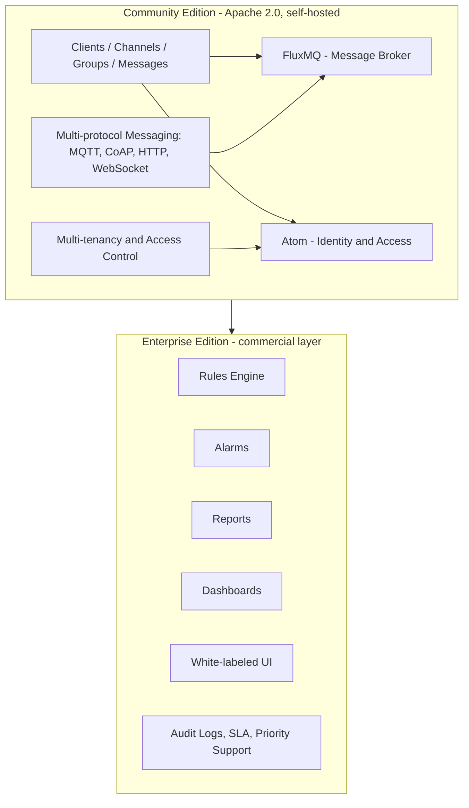
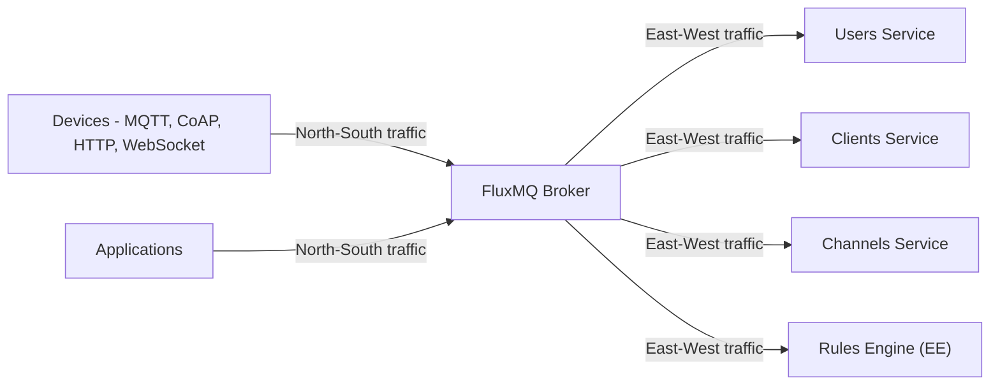

## Two editions, one open-source core

_Community Edition core and Enterprise Edition layer_

Starting today, Magistrala ships as two distinct editions. **Magistrala Community Edition (CE)** is the open-source IoT platform teams have run in production for years: multi-protocol device management, messaging, and multi-tenancy, unchanged in scope and still licensed under Apache 2.0. **Enterprise Edition (EE)** sits alongside it. It's a commercially supported layer on top of that same core, built for teams that want automation, observability, and operational tooling delivered as a managed service instead of something they assemble and run themselves.

This is a structural change, not a feature cut. We're drawing a clear line between what belongs in the open-source core and what belongs in a commercially supported operations layer, and investing directly in both.

## Why we're splitting the project

Magistrala grew out of EU-funded distributed systems research, and the open-source core has always been the point. As the platform picked up capabilities like a Rules Engine, Alarms, Reports, and Dashboards, we ended up maintaining two different kinds of software under one roof. One is a device management and messaging platform that IoT engineers self-host and operate directly. The other is an operations layer that enterprise buyers expect someone else to run for them, backed by support contracts and SLAs.

Splitting the two lets us serve both properly. Community Edition stays exactly what it is: a complete, production-grade, self-hosted IoT platform, maintained with full attention and no artificial limits on scale. Enterprise Edition becomes what enterprise teams actually need: managed operations, priority support, and operational tooling delivered turnkey, backed by an engineering commitment that a purely open-source project can't sustain on its own.

## Community Edition: the same open-source core, no gates on scale

Community Edition remains free, self-hosted, and licensed under Apache 2.0. There are no artificial limits on clients, channels, groups, or messages. If you're running Magistrala today for device management and multi-protocol messaging, nothing about how you deploy or scale it changes.

The Community UI drops a piece of friction it used to carry, too: running it no longer requires accepting a EULA. Earlier releases needed you to accept an End User License Agreement and set `MG_UI_DOCKER_ACCEPT_EULA=yes` before the UI and it's backend containers would even start. That requirement is gone. The Community UI is free to use with no license gate and no strings attached.

CE covers the primitives every IoT deployment needs:

- **Clients** for device identity and lifecycle management
- **Channels** for pub/sub messaging topics
- **Groups** for organizing clients and channels
- **Messages**, ingested and queryable through the platform's messaging services
- **Multi-tenancy and fine-grained access control**, so multiple teams or customers can share one deployment safely
- **Multi-protocol messaging** over MQTT, CoAP, HTTP, and WebSocket, so devices connect however fits their constraints, from limited edge connectivity to browser-based clients

Two parts of the CE stack are worth calling out, not because they're new, but because they're easy to underestimate from outside the project.

### FluxMQ carries both device traffic and internal service traffic

_FluxMQ: one broker for device and service traffic_

Magistrala is built on top of **[FluxMQ](https://www.absmach.eu/products/fluxmq/)**, its multi-protocol message broker. FluxMQ handles MQTT, CoAP, HTTP, and WebSocket traffic from devices and applications, and it also carries the east-west traffic between Magistrala's internal services. Most IoT platforms need a separate broker or queue for internal service communication on top of whatever handles device connectivity. Magistrala doesn't need that, because FluxMQ carries north-south device traffic and east-west service traffic on the same broker. That keeps the deployment footprint smaller and gives operators one messaging system to reason about instead of two.

### Atom unifies identity and access control

Identity and authorization in Magistrala run on **[Atom](https://www.absmach.eu/products/atom)**. Adopting Atom collapsed several separate concerns into a single layer: identity, policy evaluation, and keeping a policy engine in sync with the rest of the platform. There's no separate policy engine or sync process to keep consistent with the identity store. That has a direct operational payoff: fewer independent services to deploy and monitor for identity and access control than the platform needed before.

Both FluxMQ and Atom are established parts of the Magistrala architecture, not new additions, and both stay fully open source in Community Edition.

## Enterprise Edition: operations and automation, run for you

Enterprise Edition is where Magistrala's automation and observability tooling lives: the Rules Engine (including custom message formats), Alarms, Reports, Dashboards, and a commercial UI with white-labeling. It also includes audit logs, priority support with dedicated support hours, backups, and, at the Custom tier, a formal SLA and HA clustering.

These are the pieces that benefit most from dedicated engineering and operational investment. A rules engine that transforms and routes production messages, an alarm system that pages someone at 3 a.m., a reporting layer that finance or compliance teams depend on: each of those needs a different level of ongoing support than a self-hosted open-source component. That's what Enterprise Edition is built to provide.

EE fits a few specific situations:

- Teams that want the Rules Engine, Alarms, Reports, and Dashboards without building and operating that tooling themselves
- Vendors and system integrators who need a white-labeled UI to put in front of their own customers
- Organizations that need a formal SLA, audit logs, and priority support to satisfy internal compliance or uptime requirements

### Deployment options

Enterprise Edition is available two ways. Fully managed private cloud comes in four tiers, Prototype, Business, Enterprise, and Custom, each billed monthly or annually. Self-managed is available either as a license you operate yourself, or as a license with Abstract Machines managing the deployment on your own infrastructure.

## Community Edition vs. Enterprise Edition at a glance

| Dimension               | Community Edition (CE)           | Enterprise Edition (EE)                    |
| ----------------------- | -------------------------------- | ------------------------------------------ |
| **License**             | Open source, Apache 2.0          | Commercially licensed                      |
| **Hosting**             | Self-hosted, your infrastructure | Managed private cloud or self-managed      |
| **Rules Engine**        | Not included                     | Included, with custom message formats      |
| **Alarms**              | Not included                     | Included                                   |
| **Reports**             | Not included                     | Included                                   |
| **Dashboards**          | Not included                     | Included                                   |
| **UI / white-labeling** | Community UI                     | Commercial UI, white-labeled               |
| **Audit logs**          | Not included                     | Included                                   |
| **Support level**       | Community (GitHub, docs, forums) | Priority support, dedicated hours          |
| **Backups**             | Self-managed                     | Included                                   |
| **SLA / HA**            | Not included                     | Formal SLA and HA clustering (Custom tier) |

For exact tiers, pricing, and what's included at each level, see the full [pricing and comparison page](https://www.absmach.eu/magistrala/pricing/).

## If you're already self-hosting rules, alarms, reports, or dashboards

If your current deployment relies on the Rules Engine, Alarms, Reports, or Dashboards, there's a direct path forward. The Enterprise self-managed license lets you keep running those components on your own infrastructure under a commercial license, with the option to add Abstract Machines-managed operations later if you want it. Nothing has to move off your infrastructure to make this transition.

One thing to plan around: container artifacts for the Rules Engine, Alarms, Reports, Dashboards, and the commercial UI are being removed from the GitHub Container Registry now that they're Enterprise Edition services. If your deployment pulls those images directly, they won't keep showing up there, so move to an Enterprise self-managed license before that happens. Visit the [pricing page](https://www.absmach.eu/magistrala/pricing/) for self-managed licensing details and migration options.

## Get started

- Compare tiers and pricing for both editions: [absmach.eu/magistrala/pricing](https://www.absmach.eu/magistrala/pricing/)
- Read the Community Edition documentation: [absmach.eu/docs/magistrala/community](https://www.absmach.eu/docs/magistrala/community/user-guide/architecture/)
- Start with Enterprise Edition: reach out through the [contact page](https://www.absmach.eu/contact/) to talk to the team or start a trial
