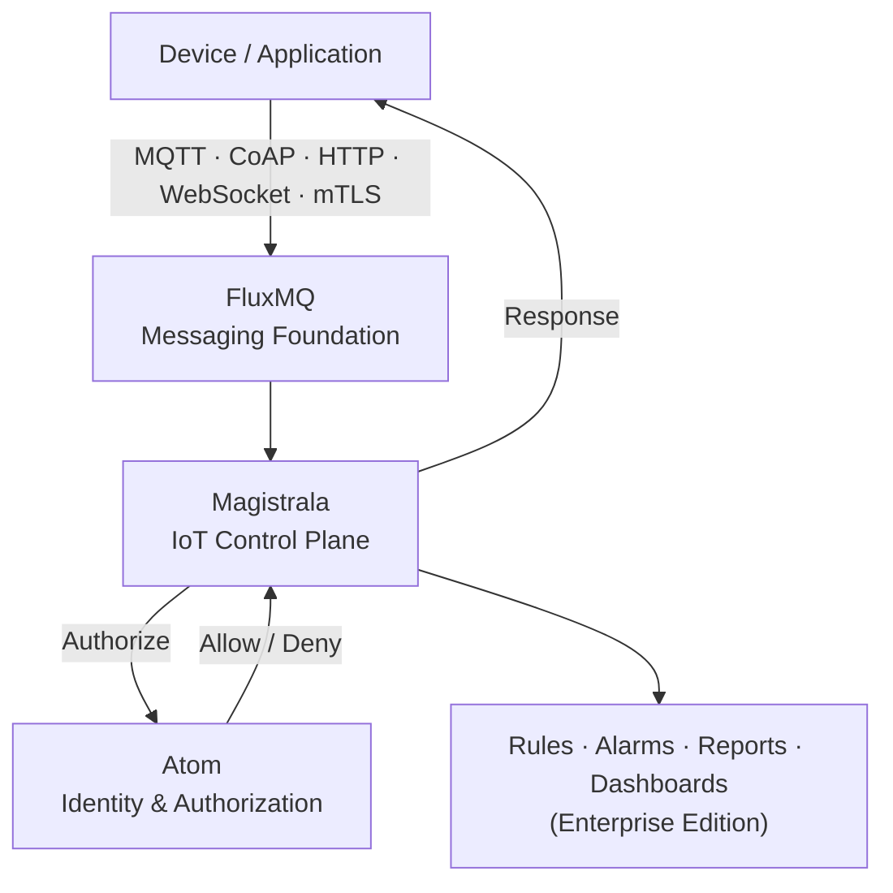

## Magistrala v1.0.0

Magistrala started as an enthusiast project, built by a small group of people who wanted to make IoT better and learn something new along the way. It's been running in production ever since, in over 400 deployments across more than 50 countries. Along the way it grew from a messaging platform into a full IoT stack: device and user management, multi-tenancy, authorization, provisioning, rules, alarms, reports, edge support, multiple protocol adapters, and a web UI. The last few release cycles brought the [Community Edition / Enterprise Edition split](/blog/magistrala-community-edition-enterprise-edition/), [Atom as the built-in identity layer](/blog/magistrala-x-atom-release/), and a run of hardening releases through [v0.50.0](/blog/magistrala-v0-50-0-release/).

v1.0.0 is where that work lands. Instead of another batch of features, this release is about making the platform's APIs, architecture, and operational behavior stable enough to build on for the long term.

---

## What v1.0 Means

A `1.0` tag carries a different promise than a pre-1.0 one. For Magistrala, it means the documented public interfaces are now stable APIs, and future changes to them follow semantic versioning. A breaking change gets a major version bump, not a silent update.

It doesn't mean the platform stops moving. New protocols, services, deployment options, and edge capabilities are still coming. What changes is that they now build on top of a fixed architectural base instead of reshaping it. Getting here took a sustained push on API correctness, input validation, authorization, predictable failure behavior, cross-service contracts, and test coverage.

---

## A Unified Architecture: Atom, FluxMQ, and Magistrala

_How a request flows through the stack_



Magistrala's architecture now has two clear foundations under it. Atom owns identity and authorization. FluxMQ owns message transport. Magistrala itself is the IoT-specific control plane on top: device management, provisioning, storage, rules, alarms, reporting, and observability. That split gives each piece a clear boundary, which makes the whole system easier to reason about, operate, and extend without the core services stepping on each other.

---

## Atom: The Identity and Authorization Layer

Users, devices, workspaces, groups, resources, roles, and policies are all represented through [Atom](https://www.absmach.eu/products/atom)'s entity and access-control model, and every Magistrala service builds on it instead of running its own identity logic. The mapping is direct:

| Magistrala concept | Atom concept                                      |
| ------------------ | ------------------------------------------------- |
| Workspace          | Tenant                                            |
| User               | Entity (human)                                    |
| Client             | Entity (device)                                   |
| Channel            | Resource                                          |
| Group              | Hierarchical organization of entities & resources |

Rules, Alarms, Reports, messaging, and provisioning all check against this one authorization model, so there's a single source of truth for who can do what. That matters more as deployments get more complex: more tenants, more roles, more devices, more applications all sharing the same instance.

---

## FluxMQ: The Messaging Foundation

Messaging has always been the center of Magistrala, and with v1.0 [FluxMQ](https://www.absmach.eu/products/fluxmq/) is formally the foundation it runs on, not an external broker sitting behind a set of adapters. Devices and applications keep using the protocols and APIs they already do. Underneath, FluxMQ gives the platform a messaging layer built for event-driven, IoT-scale workloads, with room to keep improving routing, persistence, streaming, and delivery semantics without touching the services built on top of it.

The boundary is simple: FluxMQ moves messages, Magistrala runs the IoT system around them.

---

## Device and Gateway Management

Cloud services are only part of an IoT deployment. Devices and gateways still need to be provisioned, configured, monitored, updated, and managed for their whole lifecycle, often over intermittent or restricted connectivity.

Magistrala's Bootstrap and provisioning services handle onboarding and configuration delivery for devices and gateways. Paired with the Magistrala Agent, they let you manage a fleet remotely, without direct administrative access to each machine, and keep device relationships, credentials, connectivity, and operational state consistent across cloud and edge. v1.0 focused on stabilizing exactly these boundaries: provisioning, authentication, configuration, and lifecycle behavior are now more predictable across the board.

---

## Rules, Alarms, Reports, and Dashboards

Collecting telemetry is only half the job. Magistrala's Rules Engine turns incoming data into application logic, Alarms turn system conditions into explicit operational events, and Reports and Dashboards give scheduled, structured views into what's happening. Together with the data readers and writers, they cover the path from device connectivity to application-level workflow, so most deployments don't have to build that layer themselves.

These four are part of [Enterprise Edition](/blog/magistrala-community-edition-enterprise-edition/); Community Edition ships a single-instance preview of each so you can see how they behave before deciding you need more.

---

## A More Predictable Deployment Experience

Starting a distributed system made up of identity services, a message broker, databases, readers, writers, provisioning, rules, dashboards, and observability takes real configuration. For v1.0 we tightened startup and provisioning, particularly around service identities, certificates, and Atom service credentials, so a local deployment is one command:

```bash
git clone https://github.com/absmach/magistrala.git
cd magistrala

make run_latest
```

Provisioning creates the service credentials Magistrala's components need to authenticate against Atom, and startup handles the certificates and keys internal services need. The goal: configuration errors fail early and clearly instead of showing up later as an unexplained distributed-systems failure.

---

## Tested as a Complete Platform

A large part of getting to v1.0 was testing Magistrala as a whole system rather than one service at a time: API regression tests, authorization and validation tests, negative test cases, cross-component contract checks, integration tests, UI workflows, provisioning flows, upgrade paths, and end-to-end platform runs. Component boundaries got the closest attention, since that's where distributed-system bugs usually hide.

---

## Built for Extensibility

Magistrala doesn't pretend real IoT deployments aren't distributed systems. A production setup can include brokers, databases, protocol gateways, rule engines, identity services, analytics, custom applications, and edge software, and Magistrala's job is to give those pieces a coherent framework instead of replacing them. Its core abstractions, identity, authorization, devices, resources, messaging, and events, provide shared infrastructure while letting domain-specific services stay independent. Now that the platform has a v1.0 baseline, new capabilities should be things we add around that core, not changes to the core itself.

---

## What Comes After v1.0

Reaching v1.0 doesn't slow anything down; it changes what the next round of work builds on. Edge computing, device management, messaging, automation, observability, deployment, developer tooling, and the Magistrala UI all keep moving. The difference is that they now start from stable interfaces and explicit architectural boundaries instead of a platform that has to be partly rebuilt underneath them each time.

---

## Get It

Magistrala v1.0.0 would not exist without everyone who has contributed code, filed bugs, tested releases, discussed architecture, written docs, built integrations, and run this in production over the years. Thank you.

- 🌐 Website: https://www.absmach.eu/products/magistrala
- ⚙️ GitHub: https://github.com/absmach/magistrala
- 📘 Documentation: https://www.absmach.eu/docs/magistrala

Issues, feedback, and contributions are welcome.
