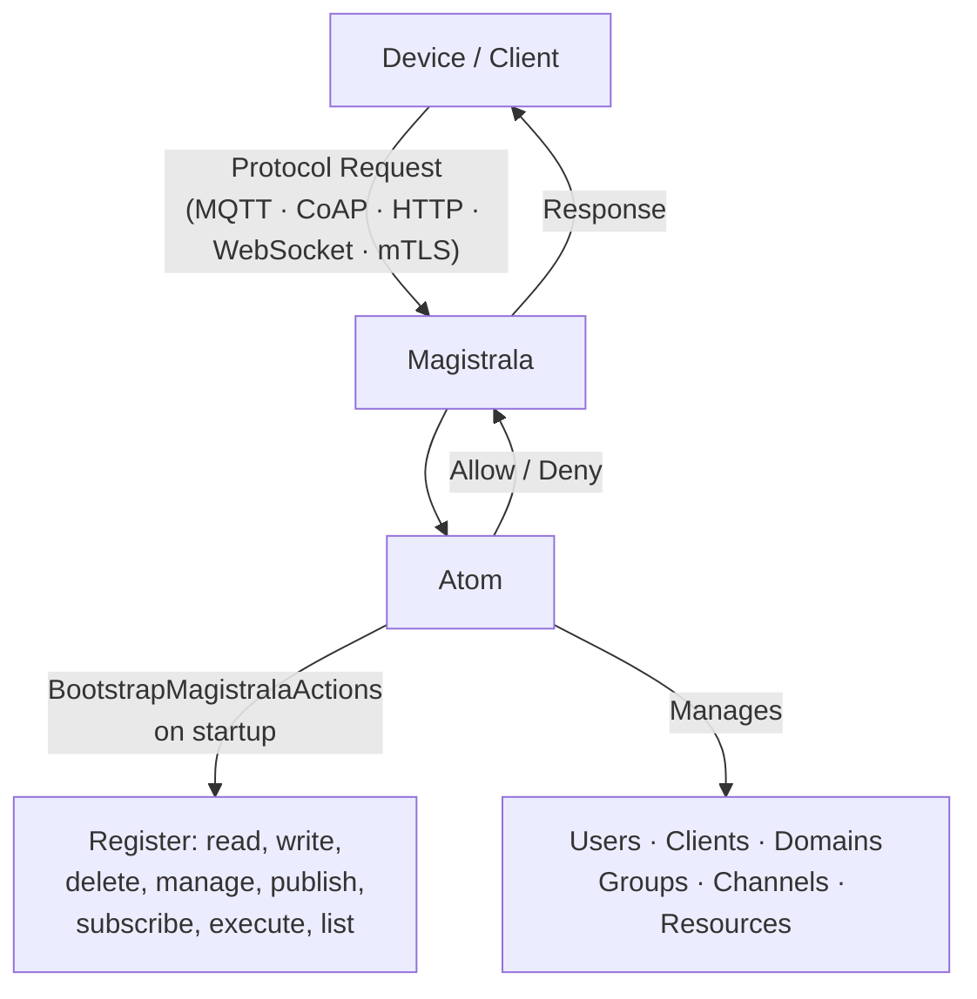
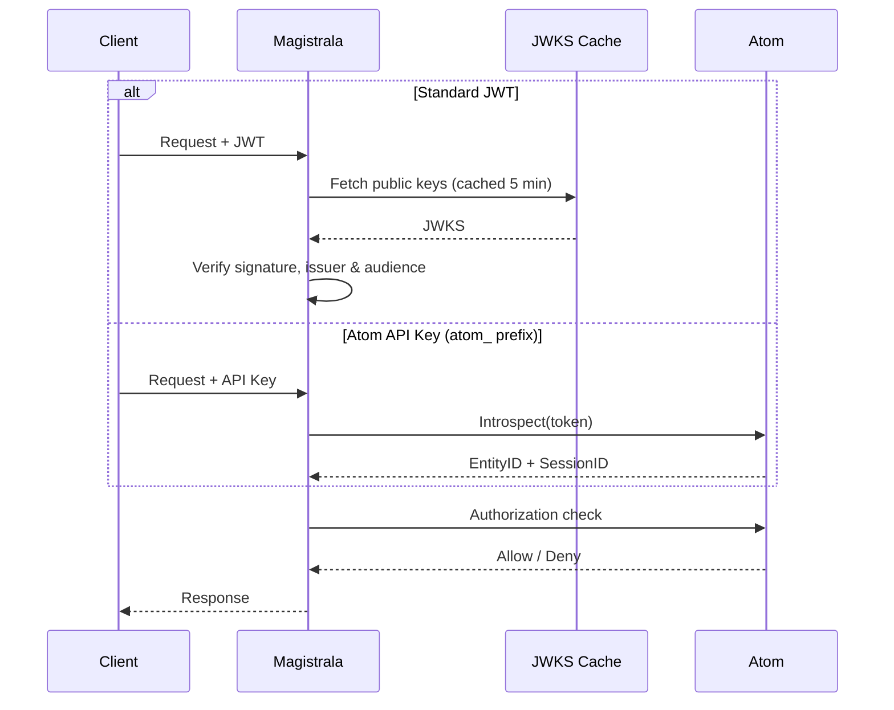

## What's New

Magistrala v0.40.0 ships with Atom as its core identity and authorization layer. The standalone microservices that previously managed users, clients, channels, and domains are gone. Atom takes over all entity management, policy evaluation, and token validation. MQTT, CoAP, HTTP, WebSocket, mTLS, and multi-tenancy all continue working without modification. The result is a significantly simpler deployment footprint without any change to the security model.

## Atom as the Core Identity and Authorization Layer

_Magistrala + Atom Architecture_



Atom is an identity and authorization service. Starting with v0.40.0, Magistrala ships with Atom as a required dependency. When a device publishes to a channel or a user modifies a rule, Magistrala routes the authorization decision to Atom. All entity management — previously spread across separate services — is now handled by Atom.

Atom is included in the Magistrala docker-compose setup. On startup, the `atom-bootstrap` service calls `BootstrapMagistralaActions`, which registers the full action set in Atom (read, write, delete, manage, publish, subscribe, execute, list) along with their applicability per resource type. Devices automatically receive publish and subscribe permissions on channels they belong to. No manual policy configuration required.

```bash
# Required Atom configuration
ATOM_URL=https://atom.example.com
ATOM_JWKS_URL=https://atom.example.com/.well-known/jwks.json
ATOM_JWT_ISSUER=https://atom.example.com
ATOM_JWT_AUDIENCE=magistrala
ATOM_SERVICE_TOKEN=<service-token>
ATOM_TIMEOUT=5s
```

## Removed Services

The services that previously handled users, clients, channels, and domains have been removed. Atom covers all of it:

| What was removed | What replaces it                     |
| ---------------- | ------------------------------------ |
| Users service    | Atom entity management (human kind)  |
| Clients service  | Atom entity management (device kind) |
| Domains service  | Atom tenant management               |
| Channels service | Atom resource management             |

Groups are managed by Atom as well. This consolidation removes several independently-running processes from a typical Magistrala deployment, reducing the number of databases, ports, and configuration surfaces to maintain.

## Automatic Resource Projection

Magistrala and Atom stay in sync through a `Projector` interface. Every time Magistrala creates, updates, or deletes a resource, it calls the projector to mirror the change in Atom.

The type mapping is direct:

| Magistrala                   | Atom     |
| ---------------------------- | -------- |
| Domain                       | Tenant   |
| User, Client                 | Entity   |
| Group                        | Group    |
| Channel, Rule, Report, Alarm | Resource |

Services that need Atom projection are wrapped at initialization using the `WithAtom` decorator:

```go
svc = atom.WithAtom(svc, projector)
```

Each service method (Create, Update, Delete) calls through to the underlying implementation first, then projects the result to Atom. If the projection call fails, the original operation still succeeds. Atom sync is best-effort by design, so a temporary network hiccup won't roll back a device registration.

## JWT and API Key Token Validation

_JWT and API Key Token Validation_



Atom issues tokens that Magistrala validates. Two formats are supported.

For standard JWTs, Magistrala fetches the JWKS from Atom's well-known endpoint and validates the signature, issuer, and audience locally. The key set is cached for five minutes to avoid a network call on every request.

For Atom API keys (identified by the `atom_` prefix), Magistrala calls Atom's introspection endpoint to verify the token and resolve the subject:

```go
if strings.HasPrefix(token, "atom_") {
    res, err := v.client.Introspect(ctx, token)
    // resolve EntityID and SessionID from active token
}
```

This means service accounts and human users can both authenticate against the same Magistrala instance using whichever credential format fits their workflow, without changes to device firmware or client code.

## Alarm Projection with Full Metadata

Alarms from Magistrala's rules engine are projected to Atom with structured attributes: the rule that triggered it, channel and client IDs, severity on a 0-100 scale, measurement name, and current assignee.

```go
res.Attributes["rule_id"] = a.RuleID
res.Attributes["channel_id"] = a.ChannelID
res.Attributes["client_id"] = a.ClientID
res.Attributes["severity"] = a.Severity
res.Attributes["measurement"] = a.Measurement
res.Attributes["assignee_id"] = a.AssigneeID
```

Alarms become visible in Atom's resource graph alongside the devices and channels they relate to. If you're building operational dashboards or cross-service automation, this means you can query alarm context from the same place you're already querying device and group data.

## Getting Started

Magistrala v0.40.0 requires Atom. The docker-compose setup includes Atom and the `atom-bootstrap` container, which handles initial configuration automatically. Set `ATOM_URL` and provide service credentials to connect Magistrala's auth service to your Atom instance.

- Documentation: [absmach.eu/docs/magistrala](https://www.absmach.eu/docs/magistrala/)
- Source: [github.com/absmach/magistrala](https://github.com/absmach/magistrala)
- Integration PR: [#3532](https://github.com/absmach/magistrala/pull/3532)

The integration is under active development. If you hit issues or have feedback from a production deployment, open an issue on GitHub.
