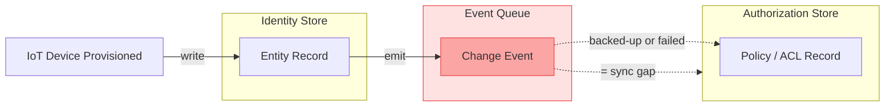
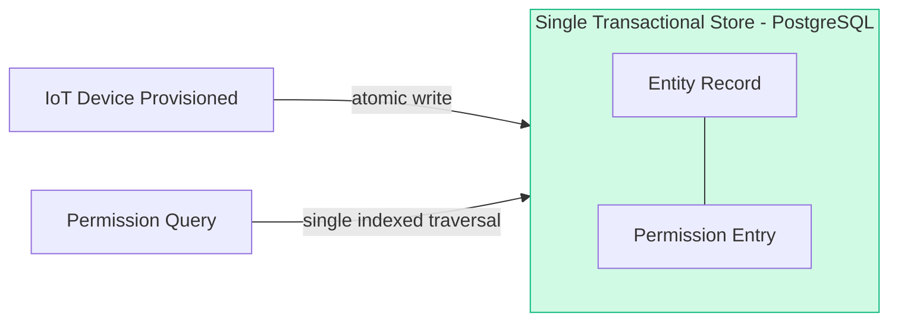

# Why Split Identity and Authorization Breaks at Scale, and How to Fix It

Every split identity and authorization system eventually produces the same failure: an entity exists in the identity store, but the corresponding authorization record hasn't arrived yet. The entity is valid. The permissions are defined. But the sync event that bridges the two is sitting in a backed-up queue, and until it processes, the access control system has no record of the entity at all.

The usual post-mortem calls it "transient sync lag." The fix is reprocessing the event. And a few weeks later, it happens again — because the fix addressed the symptom, not the architecture that made it possible.

## Why This Problem Exists

_Split Identity + Auth: The Sync Gap Problem_

Most identity and authorization systems are built as separate concerns. Identity services manage entities: users, devices, organizations, groups. Authorization services manage who can do what: policies, roles, permission evaluations. This separation looks clean in architecture diagrams.

In production, both stores must stay in sync. Every time an entity is created, updated, or deleted in the identity store, the authorization service needs to know. The standard approach is event-driven: emit a change event, consume it in the authz service, update the policy store accordingly.

The failure modes are predictable. Event queues back up under load. Consumers fall behind or fail entirely. Network partitions leave the stores in inconsistent states. The entity exists; the authz record doesn't. Or the entity was deleted, but the authz record persists, still granting access to something that no longer exists.

In IoT systems, this compounds fast. Device counts scale to tens or hundreds of thousands. Devices join and leave networks constantly. Gateways need to evaluate permissions at the edge, sometimes without a live cloud connection. The sync surface grows with every registered device, and every sync failure creates a window where authorization decisions reflect stale state.

## What Doesn't Work

Tightening the event pipeline is the first instinct. Add retries, idempotency keys, dead-letter queues, consumer group monitoring. This reduces failures but doesn't eliminate them. You're still managing eventual consistency between two systems that need to agree on the same facts.

Some teams reach for a shared database between the identity and authz services. This couples the services at the storage layer, typically creating write contention under load. Listing entities with their permissions becomes a cross-service join that neither service owns cleanly.

Dedicated authorization services like OPA or Casbin externalize policy evaluation effectively, but they still require a data pipeline to know what entities exist. The consistency problem hasn't been solved; it's been relocated.

A Zanzibar-style system resolves many of these issues at scale, but replicating that architecture means managing zookies, version-stamped reads, watch APIs, and a specialized storage tier. For most teams, the operational cost of running that infrastructure exceeds the cost of the problem it was meant to solve.

## The Fix: Collapse Identity and Authorization into One Store

_Unified Store: Atomic Identity + Authorization_

The root cause is that identity and authorization live in separate stores. The fix is to eliminate the boundary entirely.

When an entity exists in the same store as its permissions, consistency is guaranteed by the database transaction, not by an event pipeline. No sync lag. No window where a device is registered but its permissions haven't propagated yet. Provisioning a device writes its identity record and its access control entries in a single atomic operation.

### Modeling Entities and Relationships Together

Instead of maintaining foreign-key-style references between two systems, you model relationships directly in a single graph. This device belongs to this organization. This user has this role in this tenant. This service account can reach these device groups.

The relationship graph and the permission graph become the same graph. Querying "which devices can service account Y access in tenant X" is a single indexed traversal against one store, not a join across service boundaries with pagination inconsistencies on both sides.

For open-source IoT platforms managing thousands of devices across many tenants, this matters at the infrastructure level. Tenant onboarding writes to one system. Cross-tenant access policies live in one place. Policy management for a growing device fleet reduces to operations on a single, consistent store rather than coordinated writes across services.

### What the Storage Layer Needs

The data model underneath this approach should support hierarchical entity relationships with inherited permissions, fine-grained access control at the resource level, and fast list operations over large entity sets. Role-based and attribute-based access control should both be expressible without schema migrations as requirements evolve.

Deployment shouldn't require a message broker, a dedicated cache tier, or a sync daemon. A single service process backed by PostgreSQL covers the transactional requirements. Read replicas handle read scale when throughput demands it.

## How Atom Addresses This

Atom is an open-source identity and authorization service built on exactly this model. The entire stack ships as a single binary backed by PostgreSQL: no Kafka dependency, no Redis requirement, no sync process to operate or monitor.

Atom stores entities and their permissions in the same transactional store. When a device is provisioned, its identity record and its access control entries are written together. When it's deprovisioned, both are removed in the same operation. The consistency gap doesn't exist because there's only one store.

Atom's data model is structured around tenancy from the start. Organizations, users, devices, and groups are modeled as entities within a tenant hierarchy. Access control policies attach directly to entities. Policy management across hundreds of tenants works through the same API as single-tenant policy management.

Atom v0.1.0 is a production-hardened release. It's been integrated into Magistrala, a widely-used open-source IoT platform, and into Ultraviolet Cube-AI, a sovereign AI platform requiring strict multi-tenancy enforcement. Both deployments validated the model under real production workloads before the public release.

The release ships with a full UI and a developer playground for interactive policy testing. You can verify that a given entity has the expected permissions before writing the application code that depends on them.

The near-term roadmap covers optimization of heavy database query paths, read replica support for horizontal read scale, caching for hot policy evaluation paths, and an independent security audit. The v0.1.0 foundation is stable; performance work comes next.

---

If you're dealing with sync lag between identity and authorization services, Atom is worth evaluating. It's open-source and runs as a single binary backed by PostgreSQL.

- 🌐 **Website:** [absmach.eu/products/atom](https://www.absmach.eu/products/atom)
- ⚙️ **GitHub:** [github.com/absmach/atom](https://github.com/absmach/atom)
- 📘 **Documentation:** [absmach.eu/docs/atom](https://www.absmach.eu/docs/atom)
