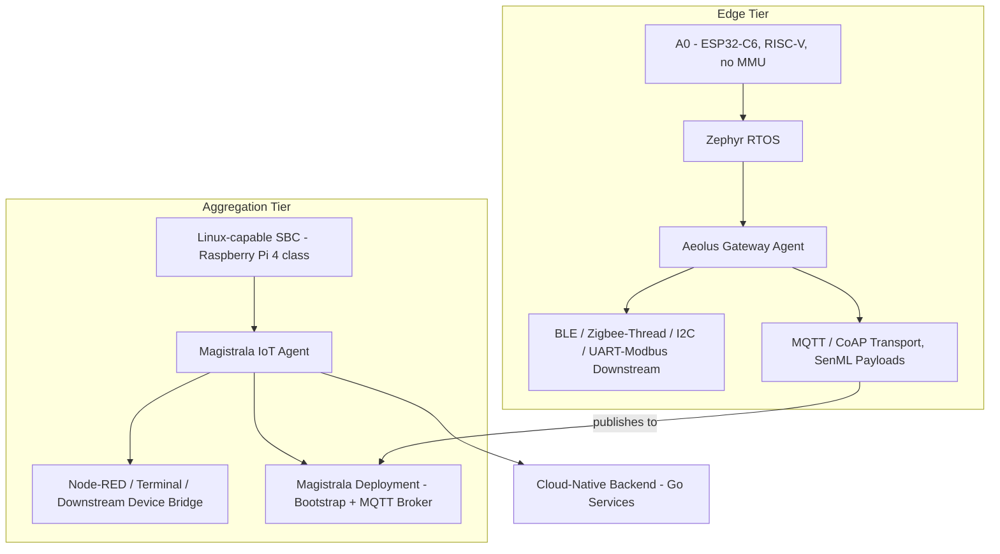
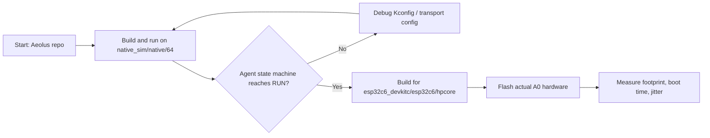

# How to Evaluate Zephyr RTOS vs Linux on A0, an Open-Source IoT Gateway

## Introduction

Most teams pick an operating system for their IoT gateway before they've mapped out where each tier of the deployment actually runs. That ordering causes rework later, once the team discovers their edge MCU can't run the Linux image they assumed it would. This tutorial walks through a repeatable way to evaluate Zephyr RTOS against a Linux-based gateway for an open-source IoT deployment, using A0, Abstract Machines' ESP32-C6 edge device, as the reference hardware for the RTOS tier.

By the end, you'll have a working Zephyr build targeting the ESP32-C6 SoC that A0 is built on, a Linux gateway tier running the Magistrala IoT Agent for comparison, and the actual commands to measure footprint, boot time, and scheduling jitter on each, instead of taking anyone's word for the numbers. This is written for embedded engineers and IoT hardware designers who already work with C or Go and have flashed firmware before, but who haven't necessarily built a Zephyr application out-of-tree or set up a Linux RT measurement pipeline.

## Prerequisites

- An A0 device (ESP32-C6, single RISC-V high-performance core plus a low-power core, 320 KB of SRAM) or an ESP32-C6-based devkit for prototyping
- Zephyr RTOS, installed via the Zephyr SDK (v0.17 or later)
- `west` (Zephyr's meta-tool, v1.0+) and Python 3.10+
- CMake 3.20+ and a RISC-V-capable Zephyr toolchain (installed automatically by the Zephyr SDK installer)
- A Linux-capable single-board computer for the gateway tier (Raspberry Pi 4 or similar), running a Debian-based OS
- Go 1.21+ (or Docker) on the Linux SBC, to build and run the Magistrala IoT Agent
- The `rt-tests` package on the Linux gateway, for jitter measurement
- Basic familiarity with devicetree and Kconfig (Zephyr) and systemd/journalctl (Linux)
- Git

## Step 1: Map your open-source IoT gateway tiers before choosing an OS

_IoT Gateway Tier Architecture: Zephyr Edge (Aeolus) vs Linux Aggregation (Magistrala Agent)_



"IoT gateway" gets used for two different jobs: the constrained edge device that talks to sensors over BLE, Zigbee/Thread, I2C, or UART/Modbus, and the aggregation point that bridges local services to the cloud. Zephyr and Linux solve different problems at these two tiers, so the comparison only makes sense once you've separated them, and once you're comparing Abstract Machines' actual gateway software at each tier rather than generic samples.

A0's ESP32-C6 has no memory management unit, so it can't run a general-purpose Linux kernel regardless of flash or RAM budget. That rules Linux out at the edge tier by hardware, not by preference. Write down your tiers before you touch a build system:

```yaml
edge_tier:
  hardware: A0 (ESP32-C6, RISC-V, no MMU)
  candidate_os: zephyr
  candidate_agent: aeolus
  responsibilities:
    - BLE / Zigbee-Thread / I2C / UART-Modbus downstream device handling
    - device registry and command routing
    - MQTT or CoAP publish of SenML telemetry

aggregation_tier:
  hardware: Linux-capable SBC (Raspberry Pi 4 class or larger)
  candidate_os: embedded_linux
  candidate_agent: magistrala_agent
  responsibilities:
    - MQTT command & control, Node-RED, and terminal bridging
    - downstream serial/I2C/Modbus device management
    - bootstrap-provisioned connection to a Magistrala deployment (local or cloud)
```

With the tiers separated, the rest of this tutorial builds one stack per tier, using Abstract Machines' own open-source agents, and gives you the tools to measure each, instead of asking you to trust a single combined number.

## Step 2: Use Aeolus, the existing Zephyr gateway agent for A0

Zephyr's mainline tree already supports the ESP32-C6 SoC through Espressif's HAL contribution, and Abstract Machines has already built the application layer on top of it: **Aeolus**, an open-source Zephyr application that runs on ESP32-C6 and acts as the gateway logic for A0. It isn't a bare board port you write from scratch — it's a working agent with a device manager, multi-protocol downstream support (BLE, Zigbee/Thread, I2C, UART/Modbus), dual MQTT/CoAP transport, OTA, NVS-backed config, and watchdog-backed health reporting.

```bash
git clone https://github.com/absmach/aeolus aeolus-workspace
cd aeolus-workspace
west init -m https://github.com/absmach/aeolus aeolus-workspace
west update
```

`src/agent.c` runs a seven-state loop — `INIT → WIFI → BOOTSTRAP → CONNECT → RUN`, with `DISCONNECTED` and `ERROR` as recovery states — that already handles WiFi/DHCP bring-up, HTTP bootstrap against a Magistrala deployment, transport selection, telemetry, heartbeat, and OTA for the ESP32-C6 SoC A0 is built on. If A0's pinout, power rail layout, or onboard sensors need adjustments beyond what Aeolus already targets, extend its board files rather than starting a devicetree from an empty `board.yml` — Aeolus already carries the pinmux and Kconfig defaults for this SoC family, and copying a devkit's devicetree node-for-node is still the fastest way to get GPIO numbers wrong.

## Step 3: Bring up Aeolus against native simulation before flashing real hardware

_Firmware Bring-Up Workflow: Native Simulation to A0 Hardware_



Validate the agent's logic against Zephyr's native simulation target first, since it boots in seconds and doesn't require hardware:

```bash
west build -b native_sim/native/64 -d build/native . -- \
  -DCONFIG_AEOLUS_SIM_SENSORS=y
./build/native/zephyr/zephyr.exe
```

Once the agent reaches its `RUN` state cleanly in simulation, build for the real ESP32-C6 target and flash it:

```bash
west build -b esp32c6_devkitc/esp32c6/hpcore -d build/esp32c6 . --sysbuild -- \
  -DCONFIG_AEOLUS_MODE_DIRECT=y \
  -DCONFIG_AEOLUS_TRANSPORT_MQTT=y
west flash
```

Treat a devkit build as a logic bring-up target only, not as a stand-in for A0 hardware, since pin mappings will differ once you point Aeolus at A0's actual sensors and radios.

## Step 4: Stand up the Linux gateway tier with the Magistrala Agent

For the aggregation tier, the software you're actually comparing against Aeolus is the **Magistrala IoT Agent**, not a bare MQTT broker. The Agent is Abstract Machines' Go-based edge agent: it bridges Node-RED, an interactive terminal, and downstream serial/I2C/Modbus devices to a Magistrala deployment over MQTT, and includes its own OTA, telemetry, heartbeat, and systemd-integrated health supervisor.

```bash
sudo apt-get update
sudo apt-get install -y mosquitto mosquitto-clients rt-tests
sudo systemctl enable --now mosquitto

git clone https://github.com/absmach/agent
cd agent
make all
```

For a full run the Agent expects a Magistrala deployment to bootstrap against (see [docs/bootstrap.md](https://github.com/absmach/agent/tree/main/docs/bootstrap.md) for the profile-based provisioning flow and required `MG_AGENT_BOOTSTRAP_*` variables); for this tutorial's footprint and latency measurements, point it at your local Mosquitto broker as the MQTT backend so you have a running process to benchmark:

```bash
MG_AGENT_MQTT_URL=localhost:1883 build/magistrala-agent &
mosquitto_sub -h localhost -t test/topic -v &
mosquitto_pub -h localhost -t test/topic -m "hello from gateway tier"
```

Expected output:

```
test/topic hello from gateway tier
```

That confirms both the broker and the Agent process are reachable before you start measuring boot time and jitter against them.

## Step 5: Measure footprint, boot time, and jitter yourself

Don't take published footprint or latency numbers at face value for either stack. They depend on your Kconfig, your kernel config, and what else is running on the box, so generate them from your own build.

For the Zephyr edge tier (Aeolus), use the built-in report targets:

```bash
west build -t rom_report
west build -t ram_report
riscv64-zephyr-elf-size build/esp32c6/zephyr/zephyr.elf
```

Expected `size` output format (your exact text/data/bss values will depend on which Kconfig options you enabled, e.g. which downstream interfaces are compiled in):

```
   text	   data	    bss	    dec	    hex	filename
  XXXXX	   XXXX	   XXXX	  XXXXX	  XXXXX	build/esp32c6/zephyr/zephyr.elf
```

For the Linux gateway tier, boot time comes from systemd's own accounting, and scheduling jitter comes from `cyclictest`:

```bash
systemd-analyze
systemd-analyze blame | head -10
sudo cyclictest -t1 -p 80 -n -i 1000 -l 10000
```

`systemd-analyze` reports total boot time plus a per-unit breakdown; run it once you've wired the Magistrala Agent into a systemd unit, per [docs/health.md](https://github.com/absmach/agent/tree/main/docs/health.md), so the accounting reflects the actual gateway-tier process rather than an idle box. `cyclictest` reports minimum, average, and maximum scheduling latency in microseconds after 10,000 loop iterations. Record both sets of numbers for your specific hardware and Kconfig/kernel config rather than reusing figures from someone else's build, since flash size, enabled drivers, and kernel options all move these results.

## Verify the comparison holds up

You should now have four data points captured directly from your own builds: Aeolus's ROM/RAM usage from `rom_report`/`ram_report`, the linked binary's section sizes from `size`, systemd's boot breakdown for the box running the Magistrala Agent, and `cyclictest`'s jitter distribution. Confirm the Aeolus image actually fits your target flash and RAM budget (check the `ram_report` total against A0's 320 KB of SRAM) before treating the comparison as conclusive. If the edge build doesn't fit, that's a real constraint Linux doesn't share with a no-MMU device, and it belongs in your decision, not in a marketing table.

## Troubleshooting

- **`west build` fails with a missing HAL module**: run `west update` again before building. Zephyr's modules manifest pulls in the Espressif HAL separately from the core tree, and a stale checkout is the usual cause.
- **Aeolus built for `esp32c6_devkitc` boots but downstream radios or sensors don't respond on A0 hardware**: you flashed the reference devkit's devicetree onto A0 hardware. Verify pin assignments against A0's schematic and extend Aeolus's board files rather than the devkit's.
- **`magistrala-agent` exits immediately on startup**: it's missing bootstrap or MQTT connection settings. Check `MG_AGENT_MQTT_URL` and, if you're using bootstrap provisioning, `MG_AGENT_BOOTSTRAP_URL`/`MG_AGENT_BOOTSTRAP_EXTERNAL_ID`/`MG_AGENT_BOOTSTRAP_EXTERNAL_KEY` — see [docs/bootstrap.md](https://github.com/absmach/agent/tree/main/docs/bootstrap.md).
- **`cyclictest: command not found`**: install the `rt-tests` package (`sudo apt-get install rt-tests`). It isn't part of a base Debian image.

## Next steps

With both tiers measured, the next step is wiring them together using the topic map both agents already speak: have Aeolus publish gateway and downstream-device telemetry to `m/<domain>/c/<data_channel>/...` on your Magistrala deployment, and drive commands back down over the `req`/`res` topics on the control channel. From there, look at Aeolus's downstream interfaces (BLE, Zigbee/Thread, I2C, UART/Modbus) and the Magistrala Agent's Node-RED and terminal integrations to connect real sensors and build operator tooling on top, instead of re-deriving either agent from scratch. Full reference code for both agents is available on GitHub at [absmach/aeolus](https://github.com/absmach/aeolus) and [absmach/agent](https://github.com/absmach/agent).