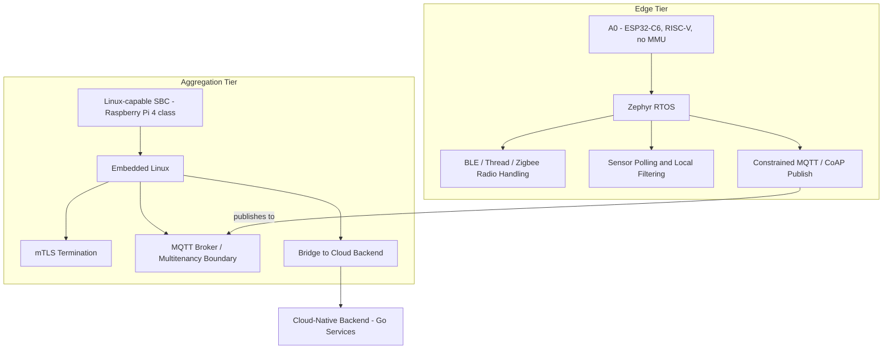
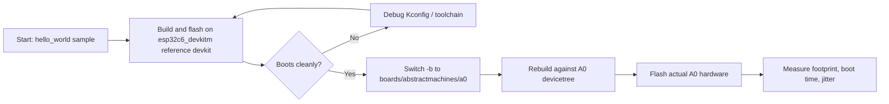

# How to Evaluate Zephyr RTOS vs Linux on A0, an Open-Source IoT Gateway

## Introduction

Most teams pick an operating system for their IoT gateway before they've mapped out where each tier of the deployment actually runs. That ordering causes rework later, once the team discovers their edge MCU can't run the Linux image they assumed it would. This tutorial walks through a repeatable way to evaluate Zephyr RTOS against a Linux-based gateway for an open-source IoT deployment, using A0, Abstract Machines' ESP32-C6 edge device, as the reference hardware for the RTOS tier.

By the end, you'll have a working Zephyr build targeting the ESP32-C6 SoC that A0 is built on, a Linux gateway tier running an MQTT broker for comparison, and the actual commands to measure footprint, boot time, and scheduling jitter on each, instead of taking anyone's word for the numbers. This is written for embedded engineers and IoT hardware designers who already work with C or Go and have flashed firmware before, but who haven't necessarily set up a Zephyr out-of-tree board or a Linux RT measurement pipeline.

## Prerequisites

- An A0 device (ESP32-C6, single RISC-V high-performance core plus a low-power core, 320 KB of SRAM) or an ESP32-C6-based devkit for prototyping
- Zephyr RTOS v3.7 LTS or later, installed via the Zephyr SDK
- `west` (Zephyr's meta-tool) and Python 3.10+
- CMake 3.20+ and a RISC-V-capable Zephyr toolchain (installed automatically by the Zephyr SDK installer)
- A Linux-capable single-board computer for the gateway tier (Raspberry Pi 4 or similar), running a Debian-based OS
- The `rt-tests` package on the Linux gateway, for jitter measurement
- Basic familiarity with devicetree and Kconfig (Zephyr) and systemd/journalctl (Linux)
- Git

## Step 1: Map your open-source IoT gateway tiers before choosing an OS

_IoT Gateway Tier Architecture: Zephyr Edge vs Linux Aggregation_



"IoT gateway" gets used for two different jobs: the constrained edge device that talks to sensors over BLE, Thread, Zigbee, or Wi-Fi, and the aggregation point that terminates TLS, brokers MQTT, and bridges to the cloud. Zephyr and Linux solve different problems at these two tiers, so the comparison only makes sense once you've separated them.

A0's ESP32-C6 has no memory management unit, so it can't run a general-purpose Linux kernel regardless of flash or RAM budget. That rules Linux out at the edge tier by hardware, not by preference. Write down your tiers before you touch a build system:

```yaml
edge_tier:
  hardware: A0 (ESP32-C6, RISC-V, no MMU)
  candidate_os: zephyr
  responsibilities:
    - BLE / Thread / Zigbee radio handling
    - sensor polling and local filtering
    - constrained MQTT or CoAP publish

aggregation_tier:
  hardware: Linux-capable SBC (Raspberry Pi 4 class or larger)
  candidate_os: embedded_linux
  responsibilities:
    - mTLS termination
    - MQTT broker / multitenancy boundary
    - bridge to cloud-native backend (Go services, distributed systems)
```

With the tiers separated, the rest of this tutorial builds one stack per tier and gives you the tools to measure each, instead of asking you to trust a single combined number.

## Step 2: Add a board port for A0 instead of reusing a devkit alias

Zephyr's mainline tree already supports the ESP32-C6 SoC through Espressif's HAL contribution, but SoC support isn't the same as board support. A0 has its own pinout, power rail layout, and peripheral wiring, so it needs its own board definition rather than borrowing a generic Espressif devkit's board files. Zephyr's documented way to do this is an out-of-tree board directory that you maintain alongside your application.

```bash
mkdir -p boards/abstractmachines/a0
cd boards/abstractmachines/a0
touch board.yml Kconfig.a0 a0_defconfig a0.dts a0.yaml
```

`board.yml` declares the board identity and the SoC it maps to:

```yaml
board:
  name: a0
  vendor: abstractmachines
  socs:
    - name: esp32c6
```

`a0.dts` extends the upstream `esp32c6` devicetree with A0's actual pin assignments for UART, the radio front end, and any onboard sensors, instead of inheriting a devkit's defaults wholesale. Fill in the pinmux nodes from A0's schematic before flashing real hardware. Copy a devkit's devicetree node-for-node and you'll get GPIO numbers wrong.

## Step 3: Bring up firmware logic against the reference SoC target first

_Firmware Bring-Up Workflow: Devkit to A0 Hardware_



Until your board port is complete, validate application logic against Espressif's ESP32-C6-DevKitM-1, which shares the same SoC and has upstream Zephyr support. Treat this strictly as a logic bring-up target, not as a stand-in for A0 hardware, since pin mappings will differ.

```bash
west init -l boards/abstractmachines/a0/../../..
west update
west build -b esp32c6_devkitm/esp32c6/hpcore samples/hello_world
west flash
```

Expected output on the serial console:

```
*** Booting Zephyr OS build v3.7.0 ***
Hello World! esp32c6_devkitm/esp32c6/hpcore
```

Once hello_world boots cleanly on the devkit, switch the `-b` argument to `boards/abstractmachines/a0` and rebuild against your own devicetree before flashing an actual A0 unit.

## Step 4: Stand up the Linux gateway tier

For the aggregation tier, install an MQTT broker on your Linux SBC so you have something to compare against the edge tier's constrained stack. Mosquitto is a reasonable default for this exercise; production deployments on the Abstract Machines stack typically run a Go-based, cloud-native broker with mTLS and multitenancy support instead.

```bash
sudo apt-get update
sudo apt-get install -y mosquitto mosquitto-clients rt-tests
sudo systemctl enable --now mosquitto
mosquitto_sub -h localhost -t test/topic -v &
mosquitto_pub -h localhost -t test/topic -m "hello from gateway tier"
```

Expected output:

```
test/topic hello from gateway tier
```

That confirms the broker is reachable before you start measuring boot time and jitter against it.

## Step 5: Measure footprint, boot time, and jitter yourself

Don't take published footprint or latency numbers at face value for either stack. They depend on your Kconfig, your kernel config, and what else is running on the box, so generate them from your own build.

For the Zephyr edge tier, use the built-in report targets:

```bash
west build -t rom_report
west build -t ram_report
riscv64-zephyr-elf-size build/zephyr/zephyr.elf
```

Expected `size` output format (your exact text/data/bss values will depend on which Kconfig options you enabled):

```
   text	   data	    bss	    dec	    hex	filename
  XXXXX	   XXXX	   XXXX	  XXXXX	  XXXXX	build/zephyr/zephyr.elf
```

For the Linux gateway tier, boot time comes from systemd's own accounting, and scheduling jitter comes from `cyclictest`:

```bash
systemd-analyze
systemd-analyze blame | head -10
sudo cyclictest -t1 -p 80 -n -i 1000 -l 10000
```

`systemd-analyze` reports total boot time plus a per-unit breakdown. `cyclictest` reports minimum, average, and maximum scheduling latency in microseconds after 10,000 loop iterations. Record both sets of numbers for your specific hardware and Kconfig/kernel config rather than reusing figures from someone else's build, since flash size, enabled drivers, and kernel options all move these results.

## Verify the comparison holds up

You should now have four data points captured directly from your own builds: Zephyr ROM/RAM usage from `rom_report`/`ram_report`, the linked binary's section sizes from `size`, systemd's boot breakdown, and `cyclictest`'s jitter distribution. Confirm the Zephyr image actually fits your target flash and RAM budget (check the `ram_report` total against A0's 320 KB of SRAM) before treating the comparison as conclusive. If the edge build doesn't fit, that's a real constraint Linux doesn't share with a no-MMU device, and it belongs in your decision, not in a marketing table.

## Troubleshooting

- **`west build` fails with a missing HAL module**: run `west update` again before building. Zephyr's modules manifest pulls in the Espressif HAL separately from the core tree, and a stale checkout is the usual cause.
- **Firmware built for `esp32c6_devkitm` boots but radios or sensors don't respond on A0 hardware**: you flashed the reference devkit's devicetree onto A0 hardware. Switch to your `boards/abstractmachines/a0` target and verify pin assignments against A0's schematic.
- **`cyclictest: command not found`**: install the `rt-tests` package (`sudo apt-get install rt-tests`). It isn't part of a base Debian image.

## Next steps

With both tiers measured, the next step is wiring them together: have A0's Zephyr application publish over MQTT to the Linux gateway tier, then add mTLS between them so the aggregation point enforces multitenancy boundaries before forwarding to your cloud-native backend. From there, look at upstreaming your A0 board port to Zephyr's board repository, so future EU research collaborators and other open-hardware teams building on ESP32-C6 don't have to repeat this setup. Full reference code for the A0 board files and the gateway-tier broker config used in this tutorial is available on GitHub.
